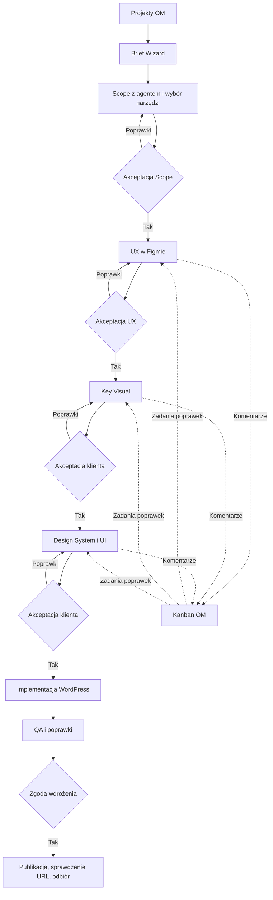

# Delivery — domyślny proces projektu i demo WordPress

## TLDR & Overview

**Status: wymagania produktowe i podział wdrożenia; implementacja niepotwierdzona.** Korekta użytkownika z 2026-09-19: OM jest miejscem prowadzenia portfolio projektów. Domyślny proces to **Brief Wizard → Scope z agentem i wybór narzędzia/platformy → akceptacja Scope → UX w Figmie i poprawki z komentarzy w Kanbanie OM → akceptacja UX → Key Visual → akceptacja klienta → Design System i UI → akceptacja klienta → implementacja WordPress → QA → zgoda wdrożenia → wdrożenie i odbiór**.

Ten dokument uzupełnia istniejącą specyfikację produktu; nie tworzy alternatywnego silnika ani nowej specyfikacji wszystkich modułów. Szczegóły wykonania enterprise pozostają w specyfikacji enterprise. [Pakiety dla zespołu](../../context/changes/autonomous-software-delivery/flow-handoff/README.md) rozdzielają pracę na istniejące strumienie.

## Problem Statement — wynik porównania

| Wymaganie | Co zapisano wcześniej | Uzupełnienie |
|---|---|---|
| Portfolio OM i wizard briefu | Projekty i FROM_BRIEF; draft wymagań | Wizard z zapisem i wznowieniem, scoping jako rozmowa i propozycje agenta |
| Wybór najlepszego narzędzia podczas Scope | Profil targetu określany przy tworzeniu projektu | Rekomendacja z uzasadnieniem oraz jawny wybór człowieka przed akceptacją Scope |
| UX → Key Visual → DS/UI | Łączna akceptacja requirements/design; szersza specyfikacja zawiera UX/DS | Oddzielne wersjonowane artefakty i bramki, Key Visual przed DS/UI |
| Figma comments → Kanban | Komentarze do snapshotów w OM, dwukierunkowe komentarze w future scope | Import rzeczywistych wątków Figmy do natywnych zadań OM w obowiązkowym flow |
| Flow builder w ustawieniach | Plan hackathonu wyklucza ogólny edytor grafu | Konfigurowalny szablon delivery przez istniejący Workflows Studio |
| WordPress demo | React obowiązkowe E2E; WP PoC, E2E bonus | WordPress jest obowiązkowym E2E tego demo; React nie zastępuje odbioru WP |
| Wdrożenie | Lokalny WP i snapshot; publiczny upload wyłączony | Osobny etap publikacji na uzgodniony cel; lokalny smoke nie zalicza publikacji |

Źródła: [plan główny](../../context/changes/autonomous-software-delivery/plan.md), zwłaszcza Overview, Non-goals i Phase 3; [pierwotna specyfikacja](../../hackathon/open-mercato-autonomous-software-delivery-spec.md), sekcje 4, 9–14 i future scope; [OSS](2026-09-18-delivery-os-hackathon.md), Data Models / Contracts v1; [enterprise](enterprise/2026-09-18-delivery-agents-hackathon.md); [narzędzia WP](2026-09-19-wordpress-studio-tools.md).

## Decyzje i pierwszeństwo

1. Ta korekta ma pierwszeństwo w sprawach kolejności etapów, akceptacji, głównego demo WP, importu komentarzy i ustawień flow. Pozostałe reguły bezpieczeństwa, scope, evidence i rozdział OSS/enterprise obowiązują nadal.
2. Dotychczasowe harmonogramy 36 h / 87 osobogodzin oraz limit WP 6 h nie są estymatą nowego zakresu. Nie deklarujemy większego budżetu: właściciele przekazują nową estymatę i blockery przed zobowiązaniem terminowym. Brak czasu nie uprawnia do oznaczenia brakującego etapu jako gotowy.
3. Zachowujemy kompatybilne FROM_DESIGN, React i OM jako dostępne ścieżki. Główne nowe demo rozpoczyna się od briefu i kończy WordPressem.
4. „Narzędzie” obejmuje platformę realizacji i wykonawcę danego etapu. Agent przedstawia możliwości, ograniczenia i uzasadnienie; użytkownik wybiera. Demo ma preselektowany WordPress, Figma dla designu i istniejący adapter wykonania, bez fikcyjnych wyborów niedostępnych providerów.
5. Akceptacja klienta dotyczy konkretnej wersji artefaktu. W demo uprawniony operator zapisuje decyzję podjętą z klientem, z nazwą zatwierdzającego i dowodem. Nie udajemy logowania klienta. Osobny portal nie jest warunkiem demo.
6. To jeden dodatek do procesu, z osobnymi pakietami wdrożenia. Nie powiela osobnych specyfikacji OSS, enterprise, WP, staff ani workflows.

## Proposed Solution / UI/UX

Lista projektów w OM pokazuje klienta, bieżący etap, oczekującą decyzję, blokery oraz następne działanie. Szczegóły projektu zawierają Brief/Scope, Design, zadania/Kanban, wykonanie i dowody. Nowy projekt uruchamia wizard; zapis częściowy pozwala wrócić do tego samego kroku.

| Etap | Co robimy i zapisujemy | Warunek przejścia |
|---|---|---|
| 1. Brief Wizard | Cel biznesowy, odbiorcy, problem, treści, funkcje, integracje, ograniczenia, inspiracje i materiały | Minimalny kompletny brief; nieznane informacje pozostają widoczne |
| 2. Scoping z agentem | Pytania/odpowiedzi, in/out, strony i kluczowe flow, AC, ryzyka, założenia, rekomendacja platformy i narzędzi | Człowiek akceptuje wersję Scope i wybrane narzędzia; nierozwiązane blokujące pytania wstrzymują etap |
| 3. UX w Figmie | Architektura informacji, low-fi/wireframes i kluczowe ścieżki; linki file/node i snapshoty | Review UX i jawna akceptacja wersji po poprawkach |
| 4. Key Visual | Kierunek wizualny na reprezentatywnym ekranie: typografia, kolorystyka, obrazy i styl | Osobna akceptacja klienta; UX approval jej nie zastępuje |
| 5. Design System + UI | Tokeny, komponenty/stany, responsywne ekrany z zaakceptowanego KV i UX | Klient akceptuje pakiet DS/UI; nierozstrzygnięte uwagi blokujące wstrzymują zgodę |
| 6. Implementacja WP | Pakiet z zaakceptowanymi Scope/UX/KV/UI → wykonanie w nowej witrynie i motywie | Rzeczywisty wynik, snapshot, testy i review; sama deklaracja agenta nie wystarcza |
| 7. QA i wdrożenie | Porównanie UI z zatwierdzonym designem, AC, zgoda publikacji na konkretny cel | Publikacja wskazanej rewizji, weryfikacja URL, końcowy odbiór |

Diagram przedstawia wymagany przyszły proces, nie stan gotowego kodu. Odrzucenie zawsze wraca do właściciela etapu; nie uruchamia następnego automatycznie.

### Figma → natywny Kanban OM

- Istniejący Kanban to `staff` / time-tracking: `packages/core/src/modules/staff/lib/time-tracking-ui/KanbanBoard.tsx`, zadania/komentarze `/api/staff/timesheets/tasks` i `/tasks/[id]/comments`. Ponownie użyć tego modułu i jego zasad dostępu, nie budować równoległego Kanbana delivery.
- DeliveryProject ma jawne scoped powiązanie z projektem staff. Jeden wątek główny Figmy daje jedno zadanie; odpowiedzi stają się komentarzami zadania. Idempotencja obejmuje tenant, organization, deliveryProject, fileKey i threadId; import odpowiedzi deduplikuje też commentId. Równoległe importy nie mogą tworzyć duplikatów.
- Zadanie zawiera źródłowy link, autora, datę, tekst, etap i referencję do artefaktu/node/snapshotu. Gdy komentarz nie ma wersji designu, zapisać moment pobrania i brak potwierdzonej wersji; nie przypisywać automatycznie do najnowszego zatwierdzonego snapshotu.
- W demo użytkownik synchronizuje rzeczywiste komentarze przyciskiem w OM; wymagane pobranie, a nie ręczne przepisanie treści. Docelowo ten sam idempotentny mechanizm uruchamia worker. Transport i dostęp do API komentarzy wymagają osobnego probe; działający Figma write nie dowodzi dostępu do komentarzy.
- Edycje i odpowiedzi aktualizują istniejący wątek z historią. Usunięcie komentarza u źródła nie usuwa audytu OM. Ponowne otwarcie lub późna odpowiedź wraca do triage, bez cichego zaakceptowania zmiany.
- Zamknięcie wątku w Figmie ani przesunięcie karty do Done nie zatwierdza UX/KV/UI. Komentarze blokujące muszą być rozstrzygnięte albo mieć jawne odroczenie zaakceptowane dla danej wersji.
- Kanban śledzi feedback i pracę ludzi; DeliveryTask śledzi wykonanie i dowody. Powiązanie zadania poprawki z DeliveryTask jest jawne, opcjonalne; synchronizacja statusów nie może ustawiać `verified` z samego Done.
- Minimalnie gwarantujemy Figma → OM. Zapis odpowiedzi OM → Figma nie jest warunkiem obecnego wymagania i nie może być deklarowany bez osobnego odbioru.

### Ustawienia → Flow builder

Ustawienia OM mają wejście „Proces realizacji projektów”: wybór domyślnego szablonu oraz otwarcie jego edytora w istniejącym Workflows Studio. Wymagane są widok grafu, edycja kolejności dozwolonych etapów, dodanie etapu review, wskazanie wykonawcy/narzędzia, osób zatwierdzających i warunków przejścia, walidacja oraz publikacja nowej wersji. To część zakresu, nie statyczny obrazek ani ekran JSON.

Każdy nowy projekt otrzymuje wskazanie i snapshot/hash opublikowanej wersji. Wszystkie zmiany semantyki (również warunków, konfiguracji narzędzi i approval policy) tworzą nową wersję; bieżące projekty pozostają przypięte. Natywna ochrona topologii workflow nie wystarcza do ochrony wszystkich tych zmian. Przełączenie istniejącego projektu wymaga jawnej analizy wpływu, ponownych zgód i sprawdzenia aktywnych prób; automatyczna migracja nie jest częścią demo.

Builder może zmienić proces biznesowy, ale nie usuwa autoryzacji, tenant scope, walidacji dowodów ani wymaganej zgody na publikację. Backend egzekwuje bramki niezależnie od grafu i UI. Domyślny szablon ma pełną kolejność wskazaną wyżej. Cofnięcie wersji domyślnej działa dla nowych projektów, nie przepisuje historii.

## Architecture

- OSS `delivery_os` przechowuje projekt, artefakty, decyzje i powiązania. `staff` jest właścicielem Kanbana. `workflows` pozostaje jedynym silnikiem instancji procesu; nie tworzyć dodatkowego lifecycle przez ręcznie zmieniany status projektu.
- Długotrwały proces projektu i istniejący workflow pojedynczej próby mają odrębne identyfikatory/odpowiedzialności. Jeden nie zastępuje drugiego. Oczekiwanie na decyzję jest trwałe; odświeżenie strony nie uruchamia agenta ponownie.
- Integracja staff i workflows przez publiczne komendy/DI/eventy/injection, identyfikatory i snapshoty; bez między-modułowych relacji ORM. Nie importować prywatnego executora workflow.
- Provider Figma należy do dedykowanego pakietu integracji. Credential refs, szyfrowanie, ACL i scoping przez istniejące mechanizmy integracji; sekrety nie trafiają do briefu, promptów, workflow context ani dokumentów.
- OSS pozostaje używalne bez enterprise: projekty, etapy, decyzje i ręczne przekazanie pakietów. Automatyczne agenty/worker są kontynuacją istniejącej specyfikacji enterprise i nie stają się zależnością OSS.
- Design System generowany w tym procesie jest DS witryny klienta. Nie nadpisuje tokenów ani governance DS platformy OM.

## Data Models & API Contracts — delta do zaprojektowania przed kodowaniem

To kontrakt produktu, a nie twierdzenie, że nowe endpointy już istnieją. **Pierwszy deliverable Mateusza to konkretna, wersjonowana delta modeli/API, przyjęta przez pozostałe strumienie przed ich integracją.**

| Potrzeba | Wymagane dane i ograniczenia |
|---|---|
| Wznowienie briefu/scopingu | Draft, krok, pytania/odpowiedzi i propozycje, wybrane narzędzia, updatedAt |
| Wersja procesu | Template id/version/hash, snapshot przypięty do projektu, workflow instance ref |
| Artefakty etapów | Stage id, wersja, hash, zależności od wcześniejszych zatwierdzonych artefaktów, attachment/Figma refs |
| Decyzje | Stage id, subject hash/version, verdict, actor, czas, powód odrzucenia; dane/dowód klienta dla akceptacji klienta |
| Powiązanie Kanbana | Delivery project id ↔ staff project id, external thread/comment keys ↔ staff task/comment ids, sync cursor, błędy/retry |
| Wynik publikacji | Target/environment, zatwierdzona rewizja/snapshot, URL, wynik sprawdzenia, osobna decyzja release |

Każdy nowy edytowalny rekord ma `updated_at`, odpowiedzi `updatedAt`, wymagany optimistic lock i czytelną obsługę konfliktów. Decyzje i zaakceptowane artefakty są append-only. Dane briefu, autorów komentarzy i decyzji klienta wymagają klasyfikacji PII, encryption maps i odczytów przez helpers szyfrowania. Sync jest paginowany i wznawialny; żadnych rosnących bez limitu tablic wszystkich komentarzy w jednym baseline.

Istniejące endpointy `/api/delivery_os/projects`, `.../baselines/:id/decisions`, `.../projects/:id/tasks`, `.../tasks/:id/attempts`, `.../tasks/:id/results`, report/deploy/release pozostają kontraktem v1. Rozszerzenie musi określić request/response, scope, ACL, lock, idempotencję, błędy i OpenAPI dla operacji draft/scoping, stage artifacts/decisions, flow settings/publish, staff linking i comment sync. Nie wymyślać payloadów per frontend.

### Migration & Backward Compatibility

Obecne `requirements|design|deploy|release` nie rozróżniają UX/KV/UI. Nie zmieniać znaczenia istniejącego `design`, nie wciskać trzech zgód w jedną decyzję i nie rozszerzać zamrożonych enumów bez przeglądu kompatybilności. Dodać wersjonowany mechanizm etapowych zgód; stare DTO/API nadal działają na starych projektach. Nowy proces musi mieć backendową ochronę również przed obejściem przez stare endpointy prób.

Profil targetu v1 jest wymagany przy utworzeniu projektu i niezmienialny przez update. Dla demo WordPress można preselektować profil już na starcie, a Scope zatwierdza ten wybór. Docelowa zmiana rekomendacji na inną platformę podczas scopingu wymaga kompatybilnego draft/intake kontraktu; nie implementować jej jako ukrytej edycji istniejącego profilu.

Zmiana zaakceptowanego Scope/UX/KV/UI tworzy nową wersję i unieważnia aktualność zależnych zgód/wyników. Historia pozostaje czytelna. Aktywne próby trzeba zatrzymać/uzgodnić przed wykonaniem nowej wersji. Migracje tylko addytywne, pliki i snapshot w PR; ich lokalne zastosowanie wymaga osobnej zgody. Istniejących projektów nie przepinać masowo.

## Edge Cases / Risks & Impact Review

| Waga | Scenariusz | Zabezpieczenie i ryzyko pozostałe |
|---|---|---|
| High | Agent lub stare API omija nowy approval gate | Kontrola przy każdej mutacji/dispatchu/publikacji; test prób obejścia |
| High | Edycja template zmienia trwające projekty | Immutable wersja/snapshot; test także zmian config/conditions, nie tylko grafu |
| High | Obcy projekt/plik Figma lub staff task | Scope serwera + prawa do projektu i połączenia; obce ID nie ujawniają danych |
| High | Timeout po utworzeniu zadania/WP site | Trwała korelacja, unikalne klucze i reconcile; nie powtarzać efektu w ciemno |
| High | Stare zgody zostają po zmianie designu | Hash i zależności wersji, ponowna akceptacja; bez automatycznego re-anchoringu |
| High | Brak możliwości publikacji WP | Oddzielny readiness targetu i deploy adapter; lokalna witryna oznacza niepełne demo |
| Medium | Rate limit/utrata dostępu Figma | Retry/backoff, cursor i widoczny sync error; brak dostępu nie daje zielonego stanu |
| Medium | Konflikt zmian draftu lub karty | 409 i reload/ponowna decyzja użytkownika, bez nadpisywania cudzej pracy |
| Medium | Rozszerzony zakres przekracza dawny budżet | Nowa estymata i jawny blocker; bez cichego usuwania flow buildera/akceptacji |

Operacyjne dane do dostarczenia przed live demo: docelowy plik Figma i uprawnienia do komentarzy, cel publikacji WP i dostęp, osoba zatwierdzająca po stronie klienta. Nie blokują napisania tego dodatku; blokują odpowiednie uruchomienia. Nie zakładamy dostępu ani zgody na produkcję.

## Integration Coverage / odbiór

Testy funkcji muszą trafić w tej samej zmianie co funkcja; fixture self-contained i sprzątane. Poniższe ID są nowymi wymaganiami, nie zaliczonymi wynikami.

| ID | Ścieżki API/UI | Dowód |
|---|---|---|
| FLOW-01 | Projects + draft/wizard/scoping | Projekt z pustego OM, zapis/wznowienie, agent pyta i proponuje Scope, człowiek wybiera WP |
| FLOW-02 | Stage artifact/decision + dispatch | Osobne Scope/UX/KV/UI; odrzucenie zatrzymuje; brak prawa/stary hash/duplikat nie omija bramki |
| FLOW-03 | Figma sync + staff projects/tasks/comments/status | Rzeczywisty komentarz → jedna karta, odpowiedź → komentarz, retry/parallel bez duplikatów; link otwiera źródło |
| FLOW-04 | Kanban + approval | Done/resolve nie aprobuje etapu; obce task/project/file ID odrzucone; 409 przy stale edit |
| FLOW-05 | Flow settings/publish + Workflows Studio | Zmiana grafu i warunku, publikacja v2; nowy projekt v2, stary pozostaje v1 także po restarcie |
| FLOW-06 | WP execute/reserve/result/review | OM→realne WP→OM, ta sama próba/baseline, snapshot+kontrole, rzeczywista poprawka; bez fikcyjnego PASS |
| FLOW-07 | Deploy/release/report | Zgoda rewizji → publikacja → URL verify → odbiór, stara rewizja i brak zgody odrzucone |
| FLOW-08 | Regresje v1, OSS-only, izolacja | Stare fixture/klienci nadal działają; brak enterprise nie psuje domeny; tenant/org/ACL zachowane |
| FLOW-09 | Zmiana Scope/UX/KV/UI | Zależne zgody tracą aktualność; stary wynik nie daje PASS; aktywna próba reconcile |

Live Figma/WP to jawna próba na uprawnionym stanowisku, nie warunek zwykłych testów CI wymagający cudzych sekretów. CI używa deterministycznych adapterów i pokrywa wszystkie operacje także negatywnie. Fixture nigdy nie zalicza live FLOW-03/06/07.

## Phasing / Implementation Plan

1. **F0 — kontrakty i readiness:** Mateusz rozpisuje deltę API/danych; Adam sprawdza rzeczywisty import komentarzy; Marcin mapuje template na Workflows Studio; Michał ustala możliwości celu publikacji. Każdy przekazuje estymatę i blokery. Brak dostępu jest blockerem próby, nie powodem zmiany scope.
2. **F1 — projekt i decyzje:** portfolio, wizard, agentowy Scope i wybór platformy, wersje artefaktów i wszystkie osobne zgody. FLOW-01/02/09 oraz testy regresji v1.
3. **F2 — design i feedback:** realny UX→KV→DS/UI, synchronizacja do staff Kanban i review. FLOW-03/04. UI i sync można budować na zatwierdzonych fixture z F0.
4. **F3 — konfigurowalny proces:** domyślny template, ustawienia, edycja/publikacja w istniejącym builderze, przypięcie wersji. FLOW-05/08. Mechanizm bramek backendu z F1 jest warunkiem integracji.
5. **F4 — WP i odbiór:** implementacja zatwierdzonego UI, poprawka, QA, publikacja i końcowa próba FLOW-01…09. Narzędzia WP rozwijać równolegle od F0; integracja wymaga poprzednich bramek.

Każdy etap pozostawia działające poprzednie ścieżki; nowe funkcje niegotowe do odbioru nie podszywają się pod ukończone. Szczegóły odpowiedzialności, plików, zależności i przekazania są w [README zespołu](../../context/changes/autonomous-software-delivery/flow-handoff/README.md).

## Final Compliance Report

Przegląd dokumentacyjny: root AGENTS, specs AGENTS, zasady core/UI, staff, workflows, QA oraz BACKWARD_COMPATIBILITY. Wymagania respektują scoping, brak relacji ORM między modułami, OSS/enterprise, wersjonowanie i prawdziwe evidence. Nie zmieniono kodu ani kontraktów publicznych.

**Granica gotowości:** komplet kierunku i pakietów wdrożenia; szczegółowa delta API/migracji oraz frontend ledger są pierwszym obowiązkowym rezultatem F0, nie już zatwierdzonym projektem technicznym. Implementerzy muszą doczytać lokalne AGENTS i uzupełnić istniejące specyfikacje modułowe. Pełny compliance kodu, integracje i live demo nie były wykonywane podczas tego przeglądu.

## Changelog

- 2026-09-19 — Porównano wcześniejszy plan z korektą użytkownika; dodano obowiązkowy WordPress E2E, osobne UX/KV/DS/UI approvals, import komentarzy do staff Kanban, wersjonowany szablon procesu i cztery pakiety wdrożenia. Nie zaliczono żadnej implementacji.
