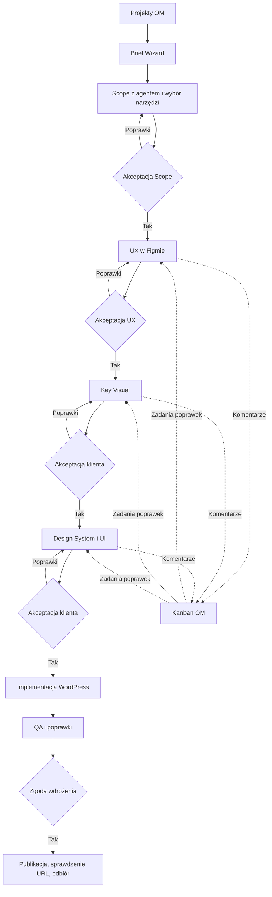

# Delivery — domyślny proces projektu i demo WordPress

## TLDR & Overview

**Status: wymagania produktowe i podział wdrożenia; implementacja niepotwierdzona.** Korekta użytkownika z 2026-09-19: OM jest miejscem prowadzenia portfolio projektów. Domyślny proces to **Brief Wizard → Scope z agentem i wybór narzędzia/platformy → akceptacja Scope → UX w Figmie i poprawki z komentarzy w Kanbanie OM → akceptacja UX → Key Visual → akceptacja klienta → Design System i UI → akceptacja klienta → implementacja WordPress → QA → zgoda wdrożenia → wdrożenie i odbiór**.

Ten dokument uzupełnia istniejącą specyfikację produktu; nie tworzy alternatywnego silnika ani nowej specyfikacji wszystkich modułów. Szczegóły wykonania enterprise pozostają w specyfikacji enterprise. [Pakiety dla zespołu](../../context/changes/autonomous-software-delivery/flow-handoff/README.md) rozdzielają pracę na istniejące strumienie.

## Problem Statement — wynik porównania

| Wymaganie | Co zapisano wcześniej | Uzupełnienie |
|---|---|---|
| Portfolio OM i wizard briefu | Projekty i FROM_BRIEF; draft wymagań | Wizard z zapisem i wznowieniem, scoping jako rozmowa i propozycje agenta |
| Wybór najlepszego narzędzia podczas Scope | Profil targetu określany przy tworzeniu projektu | Rekomendacja z uzasadnieniem oraz jawny wybór człowieka przed akceptacją Scope |
| UX → Key Visual → DS/UI | Łączna akceptacja requirements/design; szersza specyfikacja zawiera UX/DS | Oddzielne wersjonowane artefakty i bramki, Key Visual przed DS/UI |
| Figma comments → Kanban | Komentarze do snapshotów w OM, dwukierunkowe komentarze w future scope | Import rzeczywistych wątków Figmy do natywnych zadań OM w obowiązkowym flow |
| Flow builder w ustawieniach | Plan hackathonu wyklucza ogólny edytor grafu | Konfigurowalny szablon delivery przez istniejący Workflows Studio |
| WordPress demo | React obowiązkowe E2E; WP PoC, E2E bonus | WordPress jest obowiązkowym E2E tego demo; React nie zastępuje odbioru WP |
| Wdrożenie | Lokalny WP i snapshot; publiczny upload wyłączony | Osobny etap publikacji na uzgodniony cel; lokalny smoke nie zalicza publikacji |

Źródła: [plan główny](../../context/changes/autonomous-software-delivery/plan.md), zwłaszcza Overview, Non-goals i Phase 3; [pierwotna specyfikacja](../../hackathon/open-mercato-autonomous-software-delivery-spec.md), sekcje 4, 9–14 i future scope; [OSS](2026-09-18-delivery-os-hackathon.md), Data Models / Contracts v1; [enterprise](enterprise/2026-09-18-delivery-agents-hackathon.md); [narzędzia WP](2026-09-19-wordpress-studio-tools.md).

## Decyzje i pierwszeństwo

1. Ta korekta ma pierwszeństwo w sprawach kolejności etapów, akceptacji, głównego demo WP, importu komentarzy i ustawień flow. Pozostałe reguły bezpieczeństwa, scope, evidence i rozdział OSS/enterprise obowiązują nadal.
2. Dotychczasowe harmonogramy 36 h / 87 osobogodzin oraz limit WP 6 h nie są estymatą nowego zakresu. Nie deklarujemy większego budżetu: właściciele przekazują nową estymatę i blockery przed zobowiązaniem terminowym. Brak czasu nie uprawnia do oznaczenia brakującego etapu jako gotowy.
3. Zachowujemy kompatybilne FROM_DESIGN, React i OM jako dostępne ścieżki. Główne nowe demo rozpoczyna się od briefu i kończy WordPressem.
4. „Narzędzie” obejmuje platformę realizacji i wykonawcę danego etapu. Agent przedstawia możliwości, ograniczenia i uzasadnienie; użytkownik wybiera. Demo ma preselektowany WordPress, Figma dla designu i istniejący adapter wykonania, bez fikcyjnych wyborów niedostępnych providerów.
5. Akceptacja klienta dotyczy konkretnej wersji artefaktu. W demo uprawniony operator zapisuje decyzję podjętą z klientem, z nazwą zatwierdzającego i dowodem. Nie udajemy logowania klienta. Osobny portal nie jest warunkiem demo.
6. To jeden dodatek do procesu, z osobnymi pakietami wdrożenia. Nie powiela osobnych specyfikacji OSS, enterprise, WP, staff ani workflows.

## Proposed Solution / UI/UX

Lista projektów w OM pokazuje klienta, bieżący etap, oczekującą decyzję, blokery oraz następne działanie. Szczegóły projektu zawierają Brief/Scope, Design, zadania/Kanban, wykonanie i dowody. Nowy projekt uruchamia wizard; zapis częściowy pozwala wrócić do tego samego kroku.

| Etap | Co robimy i zapisujemy | Warunek przejścia |
|---|---|---|
| 1. Brief Wizard | Cel biznesowy, odbiorcy, problem, treści, funkcje, integracje, ograniczenia, inspiracje i materiały | Minimalny kompletny brief; nieznane informacje pozostają widoczne |
| 2. Scoping z agentem | Pytania/odpowiedzi, in/out, strony i kluczowe flow, AC, ryzyka, założenia, rekomendacja platformy i narzędzi | Człowiek akceptuje wersję Scope i wybrane narzędzia; nierozwiązane blokujące pytania wstrzymują etap |
| 3. UX w Figmie | Architektura informacji, low-fi/wireframes i kluczowe ścieżki; linki file/node i snapshoty | Review UX i jawna akceptacja wersji po poprawkach |
| 4. Key Visual | Kierunek wizualny na reprezentatywnym ekranie: typografia, kolorystyka, obrazy i styl | Osobna akceptacja klienta; UX approval jej nie zastępuje |
| 5. Design System + UI | Tokeny, komponenty/stany, responsywne ekrany z zaakceptowanego KV i UX | Klient akceptuje pakiet DS/UI; nierozstrzygnięte uwagi blokujące wstrzymują zgodę |
| 6. Implementacja WP | Pakiet z zaakceptowanymi Scope/UX/KV/UI → wykonanie w nowej witrynie i motywie | Rzeczywisty wynik, snapshot, testy i review; sama deklaracja agenta nie wystarcza |
| 7. QA i wdrożenie | Porównanie UI z zatwierdzonym designem, AC, zgoda publikacji na konkretny cel | Publikacja wskazanej rewizji, weryfikacja URL, końcowy odbiór |



Diagram przedstawia wymagany przyszły proces, nie stan gotowego kodu. Odrzucenie zawsze wraca do właściciela etapu; nie uruchamia następnego automatycznie.

### Figma → natywny Kanban OM

- Istniejący Kanban to `staff` / time-tracking: `packages/core/src/modules/staff/lib/time-tracking-ui/KanbanBoard.tsx`, zadania/komentarze `/api/staff/timesheets/tasks` i `/tasks/[id]/comments`. Ponownie użyć tego modułu i jego zasad dostępu, nie budować równoległego Kanbana delivery.
- DeliveryProject ma jawne scoped powiązanie z projektem staff. Jeden wątek główny Figmy daje jedno zadanie; odpowiedzi stają się komentarzami zadania. Idempotencja obejmuje tenant, organization, deliveryProject, fileKey i threadId; import odpowiedzi deduplikuje też commentId. Równoległe importy nie mogą tworzyć duplikatów.
- Zadanie zawiera źródłowy link, autora, datę, tekst, etap i referencję do artefaktu/node/snapshotu. Gdy komentarz nie ma wersji designu, zapisać moment pobrania i brak potwierdzonej wersji; nie przypisywać automatycznie do najnowszego zatwierdzonego snapshotu.
- W demo użytkownik synchronizuje rzeczywiste komentarze przyciskiem w OM; wymagane pobranie, a nie ręczne przepisanie treści. Docelowo ten sam idempotentny mechanizm uruchamia worker. Transport i dostęp do API komentarzy wymagają osobnego probe; działający Figma write nie dowodzi dostępu do komentarzy.
- Edycje i odpowiedzi aktualizują istniejący wątek z historią. Usunięcie komentarza u źródła nie usuwa audytu OM. Ponowne otwarcie lub późna odpowiedź wraca do triage, bez cichego zaakceptowania zmiany.
- Zamknięcie wątku w Figmie ani przesunięcie karty do Done nie zatwierdza UX/KV/UI. Komentarze blokujące muszą być rozstrzygnięte albo mieć jawne odroczenie zaakceptowane dla danej wersji.
- Kanban śledzi feedback i pracę ludzi; DeliveryTask śledzi wykonanie i dowody. Powiązanie zadania poprawki z DeliveryTask jest jawne, opcjonalne; synchronizacja statusów nie może ustawiać `verified` z samego Done.
- Minimalnie gwarantujemy Figma → OM. Zapis odpowiedzi OM → Figma nie jest warunkiem obecnego wymagania i nie może być deklarowany bez osobnego odbioru.

### Ustawienia → Flow builder

Ustawienia OM mają wejście „Proces realizacji projektów”: wybór domyślnego szablonu oraz otwarcie jego edytora w istniejącym Workflows Studio. Wymagane są widok grafu, edycja kolejności dozwolonych etapów, dodanie etapu review, wskazanie wykonawcy/narzędzia, osób zatwierdzających i warunków przejścia, walidacja oraz publikacja nowej wersji. To część zakresu, nie statyczny obrazek ani ekran JSON.

Każdy nowy projekt otrzymuje wskazanie i snapshot/hash opublikowanej wersji. Wszystkie zmiany semantyki (również warunków, konfiguracji narzędzi i approval policy) tworzą nową wersję; bieżące projekty pozostają przypięte. Natywna ochrona topologii workflow nie wystarcza do ochrony wszystkich tych zmian. Przełączenie istniejącego projektu wymaga jawnej analizy wpływu, ponownych zgód i sprawdzenia aktywnych prób; automatyczna migracja nie jest częścią demo.

Builder może zmienić proces biznesowy, ale nie usuwa autoryzacji, tenant scope, walidacji dowodów ani wymaganej zgody na publikację. Backend egzekwuje bramki niezależnie od grafu i UI. Domyślny szablon ma pełną kolejność wskazaną wyżej. Cofnięcie wersji domyślnej działa dla nowych projektów, nie przepisuje historii.

## Architecture

- OSS `delivery_os` przechowuje projekt, artefakty, decyzje i powiązania. `staff` jest właścicielem Kanbana. `workflows` pozostaje jedynym silnikiem instancji procesu; nie tworzyć dodatkowego lifecycle przez ręcznie zmieniany status projektu.
- Długotrwały proces projektu i istniejący workflow pojedynczej próby mają odrębne identyfikatory/odpowiedzialności. Jeden nie zastępuje drugiego. Oczekiwanie na decyzję jest trwałe; odświeżenie strony nie uruchamia agenta ponownie.
- Integracja staff i workflows przez publiczne komendy/DI/eventy/injection, identyfikatory i snapshoty; bez między-modułowych relacji ORM. Nie importować prywatnego executora workflow.
- Provider Figma należy do dedykowanego pakietu integracji. Credential refs, szyfrowanie, ACL i scoping przez istniejące mechanizmy integracji; sekrety nie trafiają do briefu, promptów, workflow context ani dokumentów.
- OSS pozostaje używalne bez enterprise: projekty, etapy, decyzje i ręczne przekazanie pakietów. Automatyczne agenty/worker są kontynuacją istniejącej specyfikacji enterprise i nie stają się zależnością OSS.
- Design System generowany w tym procesie jest DS witryny klienta. Nie nadpisuje tokenów ani governance DS platformy OM.

## Standard wykonania stron — Tailwind i natywny WordPress

**Obowiązkowe wymagania użytkownika z 2026-09-19, do wdrożenia.** Dotyczą generowanych stron klienta; nie oznaczają przebudowy backendu OM na PHP. Standard frontendowy Tailwind i małych, czytelnych plików obowiązuje także pozostałe targety stron. W ścieżce WordPress dochodzą poniższe reguły motywu, PHP, edycji i wtyczek. Zmiana flow ani wybór agenta nie wyłącza tych kryteriów jakości.

### Zakres demo — decyzja użytkownika z 2026-09-19

Pozostajemy przy **Polylang Free**, ale tłumaczenia są odłożone poza demo. Nie wymagamy
w nim drugiego języka, tłumaczenia pól ACF, synchronizacji translate/copy ani przełącznika
języka. Ich brak nie blokuje demo i nie jest wynikiem PASS: to jawnie odroczony zakres.
Instalacja Polylang pozostaje w WP-03, edycja treści/ACF/SEO w jednym języku w WP-04,
a zachowanie treści i Global Styles po redeploy pozostaje obowiązkową częścią WP-05.
Poniższe wymagania wielojęzyczne opisują etap po demo; niniejsza decyzja ma pierwszeństwo.

### Lokalny build → Studio Preview — decyzja użytkownika z 2026-09-19

Cały system i witryna muszą być przygotowane oraz zbudowane lokalnie: instalacja
WordPressa i wtyczek, konfiguracja, kompilacja motywu/assets, testy i review poprzedzają
wysyłkę. Studio Preview jest celem deploymentu gotowej, zweryfikowanej rewizji.
Nie uruchamiać na Preview instalatorów wtyczek/zależności, konfiguracji ani builda.

Kolejność: lokalna instalacja i build → lokalne kontrole → snapshot/hash gotowego
artefaktu → wymagana zgoda dla tej rewizji → upload gotowej witryny → odczytowa
weryfikacja Preview. Zmiana kodu, paczek, konfiguracji lub treści wymaga nowego lokalnego
przygotowania i kontroli przed kolejnym deploymentem; nie naprawiać zdalnej kopii.
Samo HTTP 200 na Preview nie zastępuje lokalnego builda ani dopasowania rewizji.

### Frontend i własny CSS

- Tailwind jest obowiązkową podstawą stylowania. Klasy utilities i wspólne tokeny mają pierwszeństwo; własny CSS uzupełnia zachowania, których nie warto powielać w markupie. Nie tworzyć równoległego, pełnego frameworka CSS ani zastępować Tailwinda innym frameworkiem.
- Źródłowy CSS dzielić według odpowiedzialności: foundations, konkretne komponenty/bloki oraz zgodność edytora. Stosować małe pliki z jednoznacznymi nazwami; jedna odpowiedzialność na plik. Dla własnych klas przyjmujemy BEM, niską specyficzność i brak głębokiego zagnieżdżania. Unikać globalnych nadpisań i `!important`; wyjątek wymaga uzasadnienia w review.
- Zasady clean code: opisowe nazwy, małe funkcje/komponenty, oddzielenie danych od prezentacji, współdzielone powtarzalne fragmenty i brak monolitycznych plików. Review ocenia spójność odpowiedzialności, nie sztuczne dzielenie co określoną liczbę linii.
- Małe pliki to organizacja źródeł, nie nakaz osobnego requestu HTTP dla każdego pliku. Build kompiluje zoptymalizowane assety, ładowane przez natywne enqueue WP. Bez produkcyjnego Tailwind CDN i bez ręcznej edycji wygenerowanego CSS.
- Build wykrywa klasy w PHP, szablonach, blokach i JS. Warianty wybierane z CMS mapować na skończony zestaw pełnych nazw klas, uwzględnionych w buildzie; nie składać dynamicznie fragmentów klas. Treści wprowadzane po buildzie muszą nadal mieć poprawne style.
- Tailwind, WordPress Global Styles i edytor używają zgodnych tokenów. Zweryfikować wpływ resetu/Preflight na core blocks, edytor i wtyczki; ładować style tylko w odpowiednim kontekście. Własne utilities nie mogą blokować wspieranych zmian stylów w edytorze.

### Motyw, PHP i natywne funkcje WordPressa

- Motyw korzysta z `theme.json`, natywnego edytora blokowego, bloków core, patterns i części szablonów. Preferowany szkielet to motyw blokowy; specjalne sekcje mogą używać własnych bloków/ACF, jeśli natywne nie wystarczają. Nie zastępować edytora statycznym HTML całej strony ani zewnętrznym page builderem.
- `functions.php` pozostaje krótkim bootstrapem. Kod PHP dzielić na małe pliki `inc/` według odpowiedzialności: setup, assets, blocks, ACF i integracje. Ładować je przez jawne, stałe ścieżki `require_once`; bez include zależnego od parametrów żądania lub treści CMS. Widoki współdzielić przez natywne template parts i renderery bloków, bez kopiowania logiki.
- Korzystać z natywnych API WP: hooks, capabilities, nonce, walidacja/sanityzacja wejścia i escaping wyjścia, media, menu/nawigacja, revisions oraz API treści. Nie pisać własnego CMS, autoryzacji ani bezpośrednich zapytań SQL zastępujących dostępne API.
- Funkcjonalność biznesowa i rejestracje danych, które muszą przetrwać zmianę motywu, należą do małej wtyczki projektu; motyw odpowiada za prezentację. Własne rejestracje i funkcje mają unikalny prefix/namespace.

Przykładowy podział źródeł (nie wymaga pustych plików):

```text
theme/
  style.css                 # metadane motywu
  theme.json                # ustawienia i style WP z zaakceptowanego DS
  functions.php             # bootstrap
  inc/{setup,assets,blocks,acf,integration-polylang}.php
  templates/                # szablony blokowe
  parts/                    # header, footer i inne części
  patterns/                 # edytowalne układy sekcji
  blocks/<block-name>/      # metadane i mały renderer konkretnego bloku
  acf-json/                 # wersjonowane definicje pól, bez treści/sekretów
  assets/src/css/{app.css,foundations/,components/,editor/}
  assets/src/js/             # małe moduły zachowań
  assets/dist/              # wynik powtarzalnego builda
```

### Figma → tokeny → theme.json i Tailwind

Adam przekazuje zatwierdzony snapshot designu: file/node/version (lub hash snapshotu), semantyczne nazwy tokenów, kolory, typografię, odstępy, szerokości layoutu, promienie i warianty komponentów. Każdy token ma źródło i docelowe mapowanie. Brakujące dane są jawnie uzupełniane i zatwierdzane; agent nie wymyśla nieoznaczonych wartości „z Figmy”.

Michał wdraża deterministyczne mapowanie snapshotu na `theme.json` zgodny ze schematem wybranej wersji WP oraz konfigurację/tokeny Tailwinda. Używać natywnych presets/settings/styles tam, gdzie WP je wspiera; pozostałe tokeny mają jawne mapowanie do custom properties. Tailwind odwołuje się do tych samych wartości/presetów, bez drugiej ręcznie utrzymywanej palety. Eksport Figmy nie jest gotowym `theme.json` ani źródłem treści CMS.

Wersja eksportu, mapowania i wyników trafia do artefaktów projektu. Ponowna generacja tej samej wersji daje ten sam wynik. Regeneracja designu lub redeploy nie nadpisuje po cichu treści klienta, jego zmian Global Styles, szablonów zapisanych w bazie ani pól ACF; konflikt pokazuje diff i wymaga decyzji. QA sprawdza zarówno frontend, jak i edytor po zmianach redaktora.

### Obowiązkowy zestaw wtyczek

Każda nowa witryna WordPress ma zainstalowane, aktywne i skonfigurowane **Yoast SEO, Advanced Custom Fields Pro oraz Polylang**. Używamy natywnych możliwości WP w pierwszej kolejności; ACF Pro służy modelowaniu dodatkowych pól/bloków. Instalacja jest idempotentna: retry nie reinstaluje wtyczek ani nie zeruje ich ustawień.

F0 zapisuje macierz zgodności WP/PHP/Tailwind/wtyczek, źródła paczek, wersje oraz dostęp/licencję ACF Pro. Wymagania integracji ACF–Polylang trzeba zweryfikować dla wybranych edycji; nie zakładać, że opis funkcji Polylang Pro dotyczy bezpłatnej edycji. Brak wymaganej paczki/licencji lub kompatybilności jest blockerem gotowości, nie zgodą na pominięcie wtyczki. Wymóg instalacji nie upoważnia do automatycznego zakupu licencji.

Konfiguracja obejmuje Yoast (metadane SEO, canonical/sitemap i politykę indeksowania dla środowiska), Polylang (języki, powiązania tłumaczeń, nawigację i przełącznik języka) oraz ACF (wersjonowane definicje pól, reguły translate/copy dla pól). Nie generować konkurencyjnych metatagów ani map witryny w motywie. Środowisko demo/staging pozostaje nieindeksowane; produkcja otrzymuje jawną konfigurację publikacji. Klucze/licencje i płatne archiwa pozostają poza repo oraz publicznymi dowodami.

### Pełna edytowalność — warunek odbioru

Każdy element treści klienta ma wskazane miejsce edycji w WP: teksty, nagłówki, CTA/linki, obrazy/alt, sekcje (dodanie/usunięcie/kolejność), header/footer, nawigacja i dane kontaktowe. Dla stron dochodzą SEO oraz wersje językowe. Nie przechowywać właściwej treści strony w PHP, CSS, grafice zastępującej tekst ani w niedostępnych dla redaktora danych.

Do design handoff dołączyć macierz `ekran/sekcja → blok/pole WP → miejsce edycji → tłumaczenie → test`. Blokady struktury mogą chronić komponent, ale nie blokować uzgodnionych operacji na treści i sekcjach. Role i capabilities dobrać tak, aby wskazana rola redaktora wykonywała te operacje bez dostępu do kodu i administracji wtyczkami.

QA na reprezentatywnych stronach wykonuje zmianę treści, obrazu, CTA, kolejności i dodanie sekcji, nawigacji/header/footer, danych ACF i SEO oraz utworzenie/edycję tłumaczenia w co najmniej dwóch językach. Zapis, preview i publikacja mają działać bez edycji plików lub ponownego builda. Sprawdzić zachowanie tych zmian po redeploy/regeneracji oraz zgodność edytora z frontendem na desktop/mobile.

### Źródła techniczne

- [WordPress: theme.json](https://developer.wordpress.org/themes/global-settings-and-styles/introduction-to-theme-json/) i [struktura motywu](https://developer.wordpress.org/themes/core-concepts/theme-structure/).
- [Tailwind: wykrywanie klas](https://tailwindcss.com/docs/detecting-classes-in-source-files).
- [ACF: Local JSON](https://www.advancedcustomfields.com/resources/local-json/).
- [Polylang: integracja ACF Pro i wymagania edycji](https://polylang.pro/documentation/support/guides/working-with-acf-pro/).

## Data Models & API Contracts — delta do zaprojektowania przed kodowaniem

To kontrakt produktu, a nie twierdzenie, że nowe endpointy już istnieją. **Pierwszy deliverable Mateusza to konkretna, wersjonowana delta modeli/API, przyjęta przez pozostałe strumienie przed ich integracją.**

| Potrzeba | Wymagane dane i ograniczenia |
|---|---|
| Wznowienie briefu/scopingu | Draft, krok, pytania/odpowiedzi i propozycje, wybrane narzędzia, updatedAt |
| Wersja procesu | Template id/version/hash, snapshot przypięty do projektu, workflow instance ref |
| Artefakty etapów | Stage id, wersja, hash, zależności od wcześniejszych zatwierdzonych artefaktów, attachment/Figma refs |
| Decyzje | Stage id, subject hash/version, verdict, actor, czas, powód odrzucenia; dane/dowód klienta dla akceptacji klienta |
| Powiązanie Kanbana | Delivery project id ↔ staff project id, external thread/comment keys ↔ staff task/comment ids, sync cursor, błędy/retry |
| Wynik publikacji | Target/environment, zatwierdzona rewizja/snapshot, URL, wynik sprawdzenia, osobna decyzja release |

Każdy nowy edytowalny rekord ma `updated_at`, odpowiedzi `updatedAt`, wymagany optimistic lock i czytelną obsługę konfliktów. Decyzje i zaakceptowane artefakty są append-only. Dane briefu, autorów komentarzy i decyzji klienta wymagają klasyfikacji PII, encryption maps i odczytów przez helpers szyfrowania. Sync jest paginowany i wznawialny; żadnych rosnących bez limitu tablic wszystkich komentarzy w jednym baseline.

Istniejące endpointy `/api/delivery_os/projects`, `.../baselines/:id/decisions`, `.../projects/:id/tasks`, `.../tasks/:id/attempts`, `.../tasks/:id/results`, report/deploy/release pozostają kontraktem v1. Rozszerzenie musi określić request/response, scope, ACL, lock, idempotencję, błędy i OpenAPI dla operacji draft/scoping, stage artifacts/decisions, flow settings/publish, staff linking i comment sync. Nie wymyślać payloadów per frontend.

### Migration & Backward Compatibility

Obecne `requirements|design|deploy|release` nie rozróżniają UX/KV/UI. Nie zmieniać znaczenia istniejącego `design`, nie wciskać trzech zgód w jedną decyzję i nie rozszerzać zamrożonych enumów bez przeglądu kompatybilności. Dodać wersjonowany mechanizm etapowych zgód; stare DTO/API nadal działają na starych projektach. Nowy proces musi mieć backendową ochronę również przed obejściem przez stare endpointy prób.

Profil targetu v1 jest wymagany przy utworzeniu projektu i niezmienialny przez update. Dla demo WordPress można preselektować profil już na starcie, a Scope zatwierdza ten wybór. Docelowa zmiana rekomendacji na inną platformę podczas scopingu wymaga kompatybilnego draft/intake kontraktu; nie implementować jej jako ukrytej edycji istniejącego profilu.

Zmiana zaakceptowanego Scope/UX/KV/UI tworzy nową wersję i unieważnia aktualność zależnych zgód/wyników. Historia pozostaje czytelna. Aktywne próby trzeba zatrzymać/uzgodnić przed wykonaniem nowej wersji. Migracje tylko addytywne, pliki i snapshot w PR; ich lokalne zastosowanie wymaga osobnej zgody. Istniejących projektów nie przepinać masowo.

## Edge Cases / Risks & Impact Review

| Waga | Scenariusz | Zabezpieczenie i ryzyko pozostałe |
|---|---|---|
| High | Agent lub stare API omija nowy approval gate | Kontrola przy każdej mutacji/dispatchu/publikacji; test prób obejścia |
| High | Edycja template zmienia trwające projekty | Immutable wersja/snapshot; test także zmian config/conditions, nie tylko grafu |
| High | Obcy projekt/plik Figma lub staff task | Scope serwera + prawa do projektu i połączenia; obce ID nie ujawniają danych |
| High | Timeout po utworzeniu zadania/WP site | Trwała korelacja, unikalne klucze i reconcile; nie powtarzać efektu w ciemno |
| High | Stare zgody zostają po zmianie designu | Hash i zależności wersji, ponowna akceptacja; bez automatycznego re-anchoringu |
| High | Brak możliwości publikacji WP | Oddzielny readiness targetu i deploy adapter; lokalna witryna oznacza niepełne demo |
| Medium | Rate limit/utrata dostępu Figma | Retry/backoff, cursor i widoczny sync error; brak dostępu nie daje zielonego stanu |
| Medium | Konflikt zmian draftu lub karty | 409 i reload/ponowna decyzja użytkownika, bez nadpisywania cudzej pracy |
| Medium | Rozszerzony zakres przekracza dawny budżet | Nowa estymata i jawny blocker; bez cichego usuwania flow buildera/akceptacji |

Operacyjne dane do dostarczenia przed live demo: docelowy plik Figma i uprawnienia do komentarzy, cel publikacji WP i dostęp, osoba zatwierdzająca po stronie klienta. Nie blokują napisania tego dodatku; blokują odpowiednie uruchomienia. Nie zakładamy dostępu ani zgody na produkcję.

## Integration Coverage / odbiór

Testy funkcji muszą trafić w tej samej zmianie co funkcja; fixture self-contained i sprzątane. Poniższe ID są nowymi wymaganiami, nie zaliczonymi wynikami.

| ID | Ścieżki API/UI | Dowód |
|---|---|---|
| FLOW-01 | Projects + draft/wizard/scoping | Projekt z pustego OM, zapis/wznowienie, agent pyta i proponuje Scope, człowiek wybiera WP |
| FLOW-02 | Stage artifact/decision + dispatch | Osobne Scope/UX/KV/UI; odrzucenie zatrzymuje; brak prawa/stary hash/duplikat nie omija bramki |
| FLOW-03 | Figma sync + staff projects/tasks/comments/status | Rzeczywisty komentarz → jedna karta, odpowiedź → komentarz, retry/parallel bez duplikatów; link otwiera źródło |
| FLOW-04 | Kanban + approval | Done/resolve nie aprobuje etapu; obce task/project/file ID odrzucone; 409 przy stale edit |
| FLOW-05 | Flow settings/publish + Workflows Studio | Zmiana grafu i warunku, publikacja v2; nowy projekt v2, stary pozostaje v1 także po restarcie |
| FLOW-06 | WP execute/reserve/result/review | OM→realne WP→OM, ta sama próba/baseline, snapshot+kontrole, rzeczywista poprawka; bez fikcyjnego PASS |
| FLOW-07 | Deploy/release/report | Zgoda rewizji → publikacja → URL verify → odbiór, stara rewizja i brak zgody odrzucone |
| FLOW-08 | Regresje v1, OSS-only, izolacja | Stare fixture/klienci nadal działają; brak enterprise nie psuje domeny; tenant/org/ACL zachowane |
| FLOW-09 | Zmiana Scope/UX/KV/UI | Zależne zgody tracą aktualność; stary wynik nie daje PASS; aktywna próba reconcile |
| WP-01 | Scaffold/build motywu | Tailwind compile z PHP/HTML/JS, małe pliki CSS/PHP, natywne API; brak runtime CDN; review clean code |
| WP-02 | Figma → theme.json/Tailwind | Traceability tokenów, walidacja schematu, deterministyczny eksport; frontend i edytor zgodne z zaakceptowanym DS |
| WP-03 | Instalacja/konfiguracja wtyczek | Aktywne Yoast SEO, ACF Pro, Polylang; zgodne wersje/edycje, retry bez resetu, brak licencji daje blocker |
| WP-04 | Edycja strony jako redaktor | Teksty, media, CTA, sekcje, header/footer/menu, ACF i SEO bez kodu/builda; zapis i preview/publikacja |
| WP-05 | Redeploy; tłumaczenia po demo | Demo: treści/ACF/Global Styles przetrwają redeploy, konflikt designu jest jawny. Dwa języki i tłumaczenia odroczone decyzją użytkownika |

Live Figma/WP to jawna próba na uprawnionym stanowisku, nie warunek zwykłych testów CI wymagający cudzych sekretów. CI używa deterministycznych adapterów i pokrywa wszystkie operacje także negatywnie. Fixture nigdy nie zalicza live FLOW-03/06/07.

## Phasing / Implementation Plan

1. **F0 — kontrakty i readiness:** Mateusz rozpisuje deltę API/danych; Adam sprawdza rzeczywisty import komentarzy; Marcin mapuje template na Workflows Studio; Michał ustala możliwości celu publikacji. Każdy przekazuje estymatę i blokery. Brak dostępu jest blockerem próby, nie powodem zmiany scope.
2. **F1 — projekt i decyzje:** portfolio, wizard, agentowy Scope i wybór platformy, wersje artefaktów i wszystkie osobne zgody. FLOW-01/02/09 oraz testy regresji v1.
3. **F2 — design i feedback:** realny UX→KV→DS/UI, synchronizacja do staff Kanban i review. FLOW-03/04. UI i sync można budować na zatwierdzonych fixture z F0.
4. **F3 — konfigurowalny proces:** domyślny template, ustawienia, edycja/publikacja w istniejącym builderze, przypięcie wersji. FLOW-05/08. Mechanizm bramek backendu z F1 jest warunkiem integracji.
5. **F4 — WP i odbiór:** implementacja zatwierdzonego UI według obowiązkowego standardu Tailwind/theme.json/PHP, trzy wtyczki, pełna edytowalność, poprawka, QA, publikacja i końcowa próba FLOW-01…09 oraz WP-01…05. Narzędzia WP rozwijać równolegle od F0; integracja wymaga poprzednich bramek.

Każdy etap pozostawia działające poprzednie ścieżki; nowe funkcje niegotowe do odbioru nie podszywają się pod ukończone. Szczegóły odpowiedzialności, plików, zależności i przekazania są w [README zespołu](../../context/changes/autonomous-software-delivery/flow-handoff/README.md).

## Ustawienia połączeń narzędzi — nowy zakres do wdrożenia

Decyzja użytkownika2026-09-19. Status: **TODO, wymagania produktowe; brak wdrożenia**.
Panel ma udostępniać „Ustawienia → Połączenia narzędzi” dla obsługiwanych CLI,
WordPress Studio oraz MCP Figmy. Użytkownik rozpoczyna połączenie/logowanie z panelu,
kończy autoryzację narzędzia i widzi zweryfikowany stan. Nie zakładamy, że każde CLI
obsługuje ten sam protokół logowania.

Zakres:

- Lista narzędzi z miejscem wykonania (host/worker), wykrytą instalacją i wersją,
  stanem połączenia, rozpoznanym kontem oraz ostatnim wynikiem sprawdzenia. Oddzielne
  stany: niezainstalowane, niepołączone, oczekiwanie na logowanie, połączone,
  sesja wygasła i błąd. Sama obecność programu nie oznacza autoryzacji.
- Akcje „Połącz / Zaloguj”, „Sprawdź połączenie”, „Zaloguj ponownie” i „Rozłącz”.
  Adapter uruchamia oficjalnie obsługiwany OAuth/device flow lub logowanie przeglądarkowe
  narzędzia. Jeśli narzędzie wymaga kroku na hoście, panel pokazuje instrukcję i czeka
  na potwierdzony wynik; nie przedstawia nieistniejącego webowego logowania jako gotowego.
- Studio: sprawdzenie instalacji/CLI, logowania WordPress.com i możliwości odczytu
  rejestru witryn w środowisku operatora. Instalację wykonać przed logowaniem;
  panel wskazuje brak instalacji. Połączenie nie udziela zgody na deployment.
- MCP Figmy: wybór obsługiwanego połączenia, uwierzytelnienie właściwym mechanizmem,
  sprawdzenie dostępności serwera/narzędzi i dostępu do wskazanego zasobu Figmy.
  Udany handshake nie dowodzi dostępu do pliku projektu ani zatwierdzenia designu.
- Sesję wiązać z rzeczywistym hostem wykonania, autoryzowanym aktorem i scope
  tenant/organizacja. Wspólnej sesji CLI na hoście nie udostępniać automatycznie
  innym organizacjom. Rozłączenie nie usuwa witryn ani danych użytkownika.
- Sekrety pozostają w odpowiednim magazynie poświadczeń hosta/backendu; panel,
  logi i dowody pokazują wyłącznie bezpieczny status. Nie zbierać haseł dostawców
  we własnym formularzu. Dostęp do akcji chronią dedykowane uprawnienia i audit;
  nie udostępniać dowolnego polecenia shell przez UI.

Przed implementacją właściciele UI/backendu/adapterów uzgadniają listę CLI,
możliwości logowania poszczególnych dostawców, zakres osobisty/współdzielony,
model hosta, lifecycle sesji i delta API/ACL. Korzystać z istniejącego systemu
integracji, poświadczeń i MCP tam, gdzie odpowiada wymaganiom. Ten wpis nie zatwierdza
nowych endpointów, zależności ani zmiany publicznych kontraktów. Kolejność: kontrakt
→ równoległe UI i adaptery → wspólny odbiór. Właścicieli trzeba przypisać zespołowo.

Wymagane pokrycie integracyjne API i UI (przypadki **TOOLS-01…06**):

| ID | Kryterium odbioru |
|---|---|
| TOOLS-01 | Brak programu daje stan niezainstalowany i instrukcję; zainstalowany bez sesji pozostaje niepołączony. |
| TOOLS-02 | Logowanie rozpoczęte w panelu, sukces, anulowanie i timeout mają rzeczywiste, różne stany; powtórzenie nie tworzy konkurujących sesji. |
| TOOLS-03 | Wygasła sesja, ponowne logowanie i rozłączenie odświeżają status; rozłączenie zachowuje witryny/pliki. |
| TOOLS-04 | Brak ACL i obcy tenant/organizacja/host nie pozwalają odczytać ani użyć połączenia; tokeny nie trafiają do odpowiedzi, logów lub browser storage. |
| TOOLS-05 | Studio potwierdza konto i odczyt witryn na właściwym hoście; logowanie Windows nie daje fałszywego PASS dla niepołączonego WSL/kontenera. |
| TOOLS-06 | MCP Figmy rozróżnia połączenie z serwerem od dostępu do pliku; odmowa dostępu nie jest sukcesem połączenia projektowego. |

Testy API wszystkich dodanych operacji i odpowiadające im kluczowe ścieżki panelu
mają trafić w tej samej zmianie co implementacja. TOOLS jest nowym zakresem odbioru;
nie zalicza historycznych FLOW/WP/REC i nie omija zgody target+revision dla Preview.

## Final Compliance Report

Przegląd dokumentacyjny: root AGENTS, specs AGENTS, zasady core/UI, staff, workflows, QA oraz BACKWARD_COMPATIBILITY. Wymagania respektują scoping, brak relacji ORM między modułami, OSS/enterprise, wersjonowanie i prawdziwe evidence. Nie zmieniono kodu ani kontraktów publicznych.

**Granica gotowości:** komplet kierunku i pakietów wdrożenia; szczegółowa delta API/migracji oraz frontend ledger są pierwszym obowiązkowym rezultatem F0, nie już zatwierdzonym projektem technicznym. Implementerzy muszą doczytać lokalne AGENTS i uzupełnić istniejące specyfikacje modułowe. Pełny compliance kodu, integracje i live demo nie były wykonywane podczas tego przeglądu.

## Changelog

- 2026-09-19 — Dodano TODO ustawień połączeń CLI, Studio i MCP Figmy z logowaniem inicjowanym w panelu, statusem sesji, granicami scope/hosta i testami TOOLS-01…06; bez implementacji.

- 2026-09-19 — Decyzją użytkownika pozostaje Polylang Free; tłumaczenia i integracja wielojęzyczna ACF odroczone poza demo. Jednojęzyczna edycja i zachowanie treści po redeploy pozostają wymagane.

- 2026-09-19 — Dodano obowiązkowy standard Tailwind/clean code, modułowy CSS/PHP, natywny WP z Yoast SEO/ACF Pro/Polylang, mapowanie Figma → theme.json i testy pełnej edytowalności WP-01…05. Wymagania pozostają do implementacji.

- 2026-09-19 — Porównano wcześniejszy plan z korektą użytkownika; dodano obowiązkowy WordPress E2E, osobne UX/KV/DS/UI approvals, import komentarzy do staff Kanban, wersjonowany szablon procesu i cztery pakiety wdrożenia. Nie zaliczono żadnej implementacji.

- 2026-09-19 — Doprecyzowanie użytkownika: całość instalacji, konfiguracji i builda lokalnie; Studio Preview otrzymuje gotową zweryfikowaną rewizję jako deployment, bez instalacji/builda na Preview.
