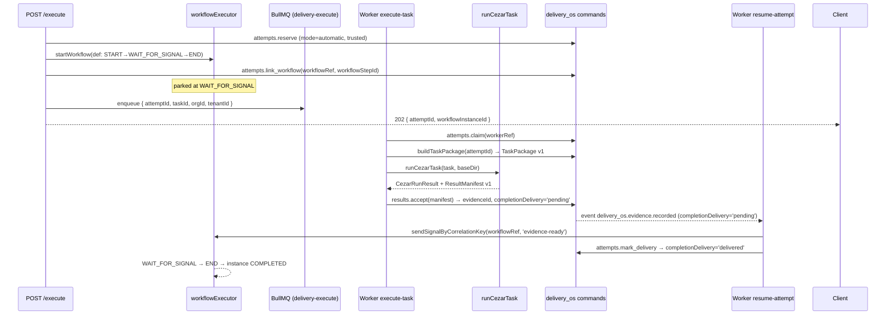

# EXEC-04: Execute API & Workflow

## 📝 TLDR

`delivery_agents` (enterprise) nie ma dziś żadnego mechanizmu uruchamiania zadań. Po EXEC-04 jeden `POST /api/delivery_agents/tasks/:id/execute` tworzy próbę (`reserved`), parkuje ją w workflow engine na `WAIT_FOR_SIGNAL`, wrzuca job do kolejki BullMQ, a worker odpala `runCezarTask` i importuje `ResultManifest v1` z powrotem do OSS. Sygnał wznawia workflow, który zamknął pętle. Retry dostarczenia sygnału nie reuruchamia CLI — ponawia tylko `sendSignal`. Recovery po restarcie: subscriber `delivery_os.evidence.recorded` + cykliczny scan `listPendingDeliveries`.

Faza fixture (H8–H14) jest już dziś odblokowana. Faza live (H16–H17+) czeka na OSS-04 (Mateusz) i UI-03 (Adam).

---

## 📝 Problem Statement

- `delivery_agents/di.ts` jest pustym stubem z komentarzem „Execution bridge services registered in EXEC-04".
- `widget.client.tsx` zawiera tylko placeholder — brak przycisków, statusu, cancel.
- Brak workera, kolejki, ani mechanizmu importu wyniku.
- Próba (`ExecutionAttempt`) ma już pola `workflowRef`, `completionDelivery`, `workerRef`, `externalRunId` — ale żaden kod ich nie wypełnia.

---

## 📝 Proposed Solution

Reuse workflows engine (`packages/core/src/modules/workflows/`) — identyczny pattern jak `agent_orchestrator` (`START → WAIT_FOR_SIGNAL → END`). EXEC-04 nie zmienia engine, nie dodaje typów aktywności. Całość ląduje wyłącznie w `packages/enterprise/src/modules/delivery_agents/`.

Alternatywa odrzucona: własna maszyna stanów w `delivery_agents` — zbędna złożoność, workflows engine jest battle-tested (TC-WF-001..054), ma obsługę cancel/pause i WAIT_FOR_SIGNAL gotową.

---

## 📝 Architecture



**Istniejące:** `workflowExecutor`, `workflowDefinitionAuthoring`, `delivery_os` commands, events, `deliveryOsAttemptQueries`, widget injection spot (wszystkie w main).
**Nowe (EXEC-04):** `executionBridge.ts`, `resultAcceptance.ts`, `attemptWorkflow.ts`, workers `execute-task` + `resume-attempt`, API route, wypełniony widget client.

---

## 📝 Data Model

Brak migracji. Wszystkie pola `ExecutionAttempt` są już w JSONB `delivery_tasks.execution_attempts` (`lib/contracts.ts` lines 620–651).

| Pole | Typ | Wypełnia |
|------|-----|---------|
| `workflowRef` | `string \| null` | `delivery_os.attempts.link_workflow` |
| `workflowStepId` | `string \| null` | `delivery_os.attempts.link_workflow` |
| `dispatchedAt` | `datetime \| null` | `delivery_os.attempts.link_workflow` |
| `workerRef` | `string \| null` | `delivery_os.attempts.claim` |
| `externalRunId` | `string \| null` | `delivery_os.results.accept` (via manifest) |
| `resultEvidenceId` | `uuid \| null` | `delivery_os.results.accept` |
| `completionDelivery` | `'pending' \| 'delivered' \| null` | `results.accept` → `mark_delivery` |
| `deliveryAttempts` | `int` | `delivery_os.attempts.mark_delivery` (inkrement przy błędzie) |
| `lastDeliveryError` | `string \| null` | `mark_delivery` przy błędzie |

**Workflow definition** (utrwalana w `workflow_definitions` przez engine):
```
ownerModule: 'delivery_agents'
ownerId:     'delivery-cezar-attempt'
steps:       START → WAIT_FOR_SIGNAL(correlationKey=workflowRef) → END
```

---

## 📝 API Contracts

### `POST /api/delivery_agents/tasks/:id/execute`

```
// packages/enterprise/src/modules/delivery_agents/api/tasks/[id]/execute/route.ts

metadata = {
  POST: {
    requireAuth: true,
    requireFeatures: ['delivery_agents.execute', 'delivery_os.attempts.manage'],
  },
}
```

**Request body:** `{ idempotencyKey: string (≥1, ≤200), targetProfileId?: string }`

**Response 202:**
```json
{
  "attemptId": "<uuid>",
  "workflowInstanceId": "<uuid>",
  "state": "reserved"
}
```

**Errors:**

| Kod | Przyczyna |
|-----|-----------|
| 400 | Brak `idempotencyKey` lub zadanie nie jest w stanie `ready`/`changes_requested` |
| 403 | Brak featury lub wrong tenant |
| 409 | Próba z tym `idempotencyKey` już istnieje (OSS idempotency guard) |
| 422 | `targetProfileId` nieznany lub brak `baselineId` na zadaniu |

**Handler flow (uproszczony):**
```
1. runRouteMutationGuards(req, container)
2. deliveryOsAttemptQueries.getAttempt(taskId, idempotencyKey) → jeśli 'reserved', zwróć 202 (idempotent)
3. delivery_os.attempts.reserve({ mode: 'automatic', trustedExecution: { source: 'delivery_agents', actorUserId: session.userId } })
4. executionBridge.start({ attemptId, taskId, orgId, tenantId }) → { workflowRef, workflowInstanceId }
5. return 202
```

### `POST /api/delivery_agents/tasks/:id/execute/cancel`

```
requireFeatures: ['delivery_agents.execute', 'delivery_os.attempts.manage']
```

**Request body:** `{ attemptId: uuid, reason?: string }`

Deleguje do `delivery_os.attempts.cancel` — ta ustawia `cancel_requested` + `stop_unconfirmed`. Worker obsługuje cancel gracefully (sprawdza stan przed wrzuceniem do kolejki).

### `POST /api/delivery_agents/tasks/:id/execute/pause` / `resume`

Deleguje do `workflowExecutor.pauseInstance` / `resumeInstance`. Próba pozostaje w `claimed`; worker nie pobiera nowych jobów z pauzowanego workflow.

---

## 📝 Nowe pliki (delivery_agents)

```
packages/enterprise/src/modules/delivery_agents/
  lib/
    executionBridge.ts          ← startWorkflow + link_workflow + enqueue
    resultAcceptance.ts         ← results.accept + set completionDelivery
    attemptWorkflow.ts          ← upsertOwnedDefinition (called on module setup)
    fakeExecutor.ts             ← DI stub for integration tests
  workers/
    execute-task.ts             ← queue: 'delivery-execute', concurrency: 2 (env: DELIVERY_EXECUTE_CONCURRENCY)
    resume-attempt.ts           ← queue: 'delivery-resume', concurrency: 5
  commands/
    executions.ts               ← triggerExecution command (wraps bridge)
  subscribers/
    evidence-recorded.ts        ← on delivery_os.evidence.recorded → resume-attempt worker
  api/tasks/[id]/execute/
    route.ts                    ← POST execute
  api/tasks/[id]/execute/cancel/
    route.ts                    ← POST cancel
  api/tasks/[id]/execute/pause/
    route.ts                    ← POST pause
  api/tasks/[id]/execute/resume/
    route.ts                    ← POST resume
```

---

## 📝 Fake Executor (DI Stub)

```typescript
// lib/fakeExecutor.ts
export interface ITaskExecutor {
  run(taskPackage: TaskPackage, baseDir: string): Promise<CezarRunResult>
}

// Zarejestrowany w DI jako 'taskExecutor'
// Produkcja: CezarTaskExecutor (wraps runCezarTask)
// Testy:    FakeTaskExecutor (zwraca fixture ResultManifest, nie odpala CLI)
```

Fake executor rejestrowany jako override w test setup — wystarczy `enqueue` → zwróć `{ exitCode: 0, stdout: '...EXEC-02-RUNNER-OK\n', runId: 'fake-run-1', durationMs: 100 }`. Manifest produkuje `mapCezarRunToResultManifest`.

---

## 📝 Edge Cases & Failure Scenarios

| Scenariusz | Zachowanie |
|------------|------------|
| `idempotencyKey` powtórzony z tą samą próbą | 202 + zwróć istniejące `attemptId` (OSS guard) |
| `idempotencyKey` konflikt z inną próbą | 409 |
| Cezar zwraca `exitCode != 0` | Worker wywołuje `results.accept` z `ResultManifest` z `checks` w stanie failed; próba → `result_received`; workflow kontynuuje do END |
| Worker pada po `claim`, przed CLI | Przy restarcie próba jest `claimed` bez `resultEvidenceId`. `listPendingDeliveries` tego nie zwróci (completionDelivery null, nie pending). Worker musi mieć `reconcile` job po N minutach: sprawdza próby `claimed` starsze niż X min bez `resultEvidenceId` → `reconciliation_required` |
| Sygnał wyemitowany zanim WAIT_FOR_SIGNAL zaparkowany | `sendSignalByCorrelationKey` ponawia z exp backoff (max 3 próby × 2s). Jeśli WAIT_FOR_SIGNAL nie odpowiada → `reconciliation_required`. (Constraint z TC-DELIVERY-EXEC-001: `link_workflow` MUSI poprzedzać enqueue) |
| Resume worker pada po `mark_delivery` | `mark_delivery` jest idempotentne — ponowne wywołanie zwraca 200 bez zmian |
| Cancel podczas wykonywania CLI | Worker sprawdza stan próby po zakończeniu CLI. Jeśli `cancel_requested` → wywołuje `results.accept` z `outcome: 'cancelled'` zamiast normalnego importu |
| Dwie równoległe próby tego samego zadania | OSS blokuje drugą (task w stanie `executing` nie przyjmuje nowej próby przez `reserve`) |

---

## 📝 Recovery po restarcie

1. **Subscriber** `delivery_os.evidence.recorded` (persistent) → enqueue `resume-attempt` job z `{ evidenceId, attemptId }`.
2. **Periodic scan** (cron lub przy starcie workera): `listPendingDeliveries(scope)` → ponów `sendSignal` dla każdego `completionDelivery='pending'`. Max 3 próby, potem `lastDeliveryError` + log.
3. **Uncertain start reconciliation**: osobny cron co 10 min — scan prób `claimed` bez `resultEvidenceId` starszych niż 30 min → `reconcile(resolution: 'unknown')` → UI pokazuje `reconciliation_required`.

---

## 📝 Risks & Impact Review

| Ryzyko | Ocena | Mitygacja |
|--------|-------|-----------|
| Cezar worker zabija replikę (długi CPU) | Medium | concurrency: 2 per pod; osobny Kubernetes node selector w produkcji |
| Duplicate delivery sygnału | Low | `mark_delivery` idempotentne; workflow engine odrzuca powtórzony sygnał dla zamkniętego stepu |
| Connection pool (worker + web + scheduler) | Medium | Osobna pula dla workerów; sprawdzić `web_pool_max + worker_pool_max + scheduler ≤ max_connections` przed deployem |
| OSS-04 nie gotowe na czas | Medium | Fixture phase izoluje EXEC-04 — można mergować i testować bez live commands |
| Regresjia workflows engine | Low | 54+ istniejących testów integracyjnych; EXEC-04 nie modyfikuje engine |

---

## 📝 Decisions in play

Opiera się na: hackathon spec enterprise §§ Execution protocol, Workflow definition, Worker configuration, Recovery/retry.
Nie superseduje żadnych aktywnych decyzji OSS.
Owner do zatwierdzenia scope cancel/pause jako HTTP API (vs. tylko internal): Michał.

---

## 📋 Phasing

**Faza 1 (fixture, H8–H14) — odblokowana dziś**
Pełna implementacja w `delivery_agents` + testy na fake executorze. Nie wymaga live commands OSS-04.

**Faza 2 (live, H16–H17+) — czeka na OSS-04 + UI-03**
Podłączenie prawdziwych komend, vertical run z prawdziwym CLI.

---

## 📋 Implementation Plan

### Faza 1 — Fixture bridge

**Step 1: DI + Workflow definition**
- `lib/attemptWorkflow.ts`: `upsertOwnedDefinition({ ownerModule: 'delivery_agents', ownerId: 'delivery-cezar-attempt', steps: [START, WAIT_FOR_SIGNAL, END] })`
- `di.ts`: rejestracja `workflowDefinitionAuthoring` (resolve z core), `taskExecutor` (produkcja: `CezarTaskExecutor`, test: `FakeTaskExecutor`)
- `setup.ts`: wywołaj `attemptWorkflow.upsert()` przy `onTenantCreated`
- `yarn generate` po zmianach

**Step 2: Execution bridge**
- `lib/executionBridge.ts`:
  1. `delivery_os.attempts.reserve` (trusted)
  2. `workflowExecutor.startWorkflow(def)`
  3. `delivery_os.attempts.link_workflow(workflowRef, workflowStepId)`
  4. Potwierdź parking (poll `workflowExecutor.getInstanceStep` max 3×500ms)
  5. Enqueue `{ attemptId, taskId }` do `delivery-execute`
  6. Zwróć `{ attemptId, workflowInstanceId }`

**Step 3: Execute worker**
- `workers/execute-task.ts`: `metadata.queue = 'delivery-execute'`, `concurrency = process.env.DELIVERY_EXECUTE_CONCURRENCY ?? 2`
- Flow: `claim` → `buildTaskPackage` → `taskExecutor.run()` → `results.accept` → log
- Obsługa cancel: sprawdź stan po `run()`, jeśli `cancel_requested` → accept z `outcome: 'cancelled'`

**Step 4: Result acceptance**
- `lib/resultAcceptance.ts`: `delivery_os.results.accept(manifest, scope)` → `{ evidenceId }`
- Idempotent: jeśli `resultEvidenceId` już ustawione → skip + zwróć

**Step 5: Resume worker**
- `workers/resume-attempt.ts`: `metadata.queue = 'delivery-resume'`, `concurrency = 5`
- Flow: `sendSignalByCorrelationKey(workflowRef, 'evidence-ready')` z retry 3× → `mark_delivery`

**Step 6: Subscriber**
- `subscribers/evidence-recorded.ts`: persistent, on `delivery_os.evidence.recorded` gdzie `completionDelivery = 'pending'` → enqueue `resume-attempt`

**Step 7: API route execute**
- `api/tasks/[id]/execute/route.ts` z metadata guard, idempotency check, delegacja do `executionBridge.start()`
- `api/tasks/[id]/execute/cancel/route.ts`, `pause/route.ts`, `resume/route.ts`

**Step 8: Widget client**
- `widget.client.tsx`: przyciski Execute / Cancel / Pause, status próby z OSS (hook na `delivery_os.task.updated`), obsługa `stop_unconfirmed`

**Step 9: Testy integration (fake executor)**
- TC-DELIVERY-EXEC-001: auth, guard, workflow parked before enqueue
- TC-DELIVERY-EXEC-002: worker claim → fake run → evidence → resume signal
- TC-DELIVERY-EXEC-003: duplicate `idempotencyKey` → idempotent 202
- TC-DELIVERY-EXEC-004: cancel mid-execution → `cancel_requested` + accepted outcome
- TC-DELIVERY-EXEC-005: resume worker retry na brakujący sygnał

### Faza 2 — Live

**Step 10: Podłączenie prawdziwego CLI**
- Swap `FakeTaskExecutor` → `CezarTaskExecutor` przez env var `DELIVERY_EXECUTOR=cezar`
- `yarn mercato queue worker delivery-execute --concurrency=2`

**Step 11: E2E vertical run**
- Jeden pełny run z prawdziwym baseline (z UI-03) + dwa równoległe

**Step 12: Recovery w produkcji**
- Cron reconciliation co 10 min (scheduler)
- Monitor `completionDelivery='pending'` dashboard
