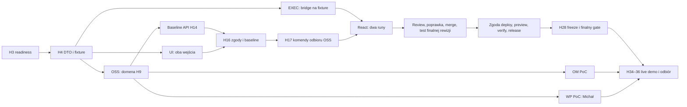

# Równoległe plany wdrożenia — 4 osoby, H0–H36

> **Korekta kierunku — 2026-09-19:** [dodatek produktowy](../../../../.ai/specs/2026-09-19-delivery-project-flow-addendum.md) ma pierwszeństwo w zakresie domyślnego flow, osobnych akceptacji UX/KV/DS/UI, komentarzy Figma → Kanban, ustawień procesu i WordPress E2E jako głównego demo. [Nowe pakiety dla zespołu](../flow-handoff/README.md). Poniższy dokument zachowuje wcześniejsze ustalenia techniczne; dawne React-first/WP-PoC i estymaty nie stanowią odbioru ani wyceny rozszerzonego zakresu. To zmiana wymagań, nie potwierdzenie implementacji.

Data rozpiski: 2026-09-19. Źródło: [zatwierdzony plan po review](../plan.md). Ten dokument rozdziela wykonanie; nie zmienia architektury, zakresu ani kryteriów odbioru. GitHub Issues i etykiety nie są używane — ustalenie użytkownika. Zadania identyfikujemy w Markdown i commitach. Data startu nie jest narzucona: H0 oznacza wspólny start zespołu.

Drzewo kolejności i rozgałęzień: [task-tree.md](task-tree.md).

Aktualny przydział po nocnych branchach: [kolejna runda — 2026-09-19](next-tasks-2026-09-19.md).

## Plany do podziału w zespole

| Plan | Zakres | Bazowy nakład | Dostęp do WP |
|---|---|---:|---|
| [OSS](01-oss-domain.md) | Domena, kontrakty, baseline, odbiór wyników, integracja, raport | 23 h | Nie |
| [EXEC](02-execution.md) | Enterprise, Cezar, workflow, recovery, PoC OM | 22 h | Nie |
| [UI](03-design-ui.md) | Figma, oba wejścia, ekran zadań i raportu | 22 h | Nie |
| [QA](04-quality-preview.md) | Testy kontraktów/AC, preview React, gate i odbiór | 14 h | Nie, korzysta z przekazanych artefaktów |
| [WP — Michał](05-wordpress-michal.md) | Własne narzędzia Studio, nowa witryna; zależny PoC później | **6 h max** | **WP-M01, WP-M02, WP-M03: Michał — wymagany dostęp** |
| **Razem** | Cztery równoległe stanowiska; WP wydzielone z dawnego przydziału QA | **87 h** | Bez piątej osoby |

Nazwy OSS/EXEC/UI/QA są strumieniami, nie przypisaniem osób. Wyjątkiem jest pakiet WP: czynności dostępu do Studio wykonuje Michał lub upoważniony agent. Własny pakiet i fixture pozwalają innym pisać mapowanie, testy i UI bez sesji Studio. Ich czas też zalicza się do limitu WP. Szczegół niezależnych prac: [własne narzędzia Studio](../../wordpress-studio-tools/plan.md). Limit 6 h nie gwarantuje całego PoC; podłączenie OSS/enterprise pozostaje zależne i lokalny smoke go nie zalicza.

87 h to przeniesiona estymata planu, nie potwierdzenie wykonalności po review. Po H3 zespół zapisuje ponowną estymatę na podstawie prób i czasu gate. Dodatkowe recovery/testy mogą wymagać bufora. 57 h różnicy do nominalnych 144 obejmuje odpoczynek, oczekiwanie i komunikację; nie traktować jej jako 57 h gwarantowanej dodatkowej pracy. Obowiązkowego zakresu nie usuwać bez decyzji użytkownika; pierwsze rezygnacje dotyczą już opcjonalnego WP E2E i automatycznego mostka WP.

## Harmonogram bez kolizji wewnątrz strumienia

Czas oznacza aktywne bloki pracy. Narzędzia/build mogą działać w przerwach, ale nie zakładamy, że w tym czasie ktoś równocześnie wykonuje dodatkowe zadanie. Gotowość jest potwierdzana dowodem; dojście zegara do godziny nie zalicza bramki.

| Strumień / zadanie | Bloki H | h | Rezultat lub warunek przekazania |
|---|---|---:|---|
| OSS-01 | 0–2 | 2 | Host OM, repo React, próba build/test, początek pomiaru gate |
| OSS-02 | 3–9 | 6 | H4 robocze DTO + fixture; H9 realna domena/export; odbiór H10 |
| OSS-03 | 10–14 | 4 | API baseline/decisions/proposals dla UI i QA |
| OSS-04 | 16–19, 20–22 | 5 | Odbiór wyników, task listy, poprawka i finalna integracja |
| OSS-05 | 24–26 | 2 | Report i decyzje publikacji/release |
| OSS-06 | 28–30, 34–36 | 4 | Naprawy i wspólny odbiór |
| EXEC-01 | 0–3 | 3 | Rzeczywisty CLI, async/Redis, decyzja trybu |
| EXEC-02 | 3–7 | 4 | Provider i szkielet rozszerzenia enterprise |
| EXEC-04 | 8–14, 16–19 | 9 | Bridge na fixture, potem pionowy live flow i równoległe runy |
| EXEC-05 | 20–22 | 2 | PoC OM: rzeczywisty export/import |
| EXEC-06 | 28–30, 34–36 | 4 | Recovery/cancel/restart i demo |
| UI-01 | 0–3 | 3 | Figma write/read/render na stanowisku demo |
| UI-02 | 4–6 | 2 | Lista/szczegóły i InjectionSpot |
| UI-03 | 6–10, 12–15 | 7 | Dwa wejścia, generacja/poprawka Figmy, podłączenie baseline |
| UI-04 | 16–20 | 4 | UI wykonania/manual flow, task formularza |
| UI-05 | 24–26 | 2 | Raport i decyzje wydania |
| UI-06 | 30–32, 34–36 | 4 | Poprawki UX i live demo |
| QA-02 | 4–6 | 2 | Harness, fixture, tenant/ACL i profile kontroli |
| QA-03 | 14–16 | 2 | Odbiór baseline API, następnie obu flow UI |
| QA-04 | 8–10, 19–22 | 5 | Najpierw harness, potem review/poprawka/test finalnego commitu |
| QA-05 | 26–27 | 1 | Publikacja po zgodzie i weryfikacja React preview |
| QA-06 | 28–30, 34–36 | 4 | Finalny gate, raport i odbiór |
| **WP-M01 — Michał** | **0–2** | **2** | **Readiness Studio i kontrakt własnych narzędzi** |
| **WP-M02 — Michał** | **22–26** | **4 max** | **Pozostały budżet: narzędzia; PoC po gotowości OSS/enterprise** |
| **WP-M03 — Michał** | **W pozostałym czasie WP-M02** | **0 dodatkowych** | **Opcjonalne E2E/retest, tylko w limicie 6 h** |

Najprostsze obsadzenie: Michał wybiera QA + WP; trzy pozostałe osoby wybierają OSS, EXEC i UI. To przykład, nie przydział. Jeśli Michał wybierze OSS/EXEC/UI, osoba obsadzająca QA ma wolne rezerwacje H0–2 i H22–26: przejmuje w tych godzinach zadania jego strumienia, a Michał robi WP. Dla EXEC/UI kończy on własne readiness H2–3; dla OSS/UI przekazuje też odpowiedni raport H24–26. Uzgodnić dostęp Figma/CLI i kompetencje zastępcy przed H0. Zapisać zamianę wraz z własnością plików; nie dodawać WP na wierzch równoczesnej pracy Michała. Jeśli taka zamiana nie jest możliwa, zespół musi przeplanować obsadę przed startem.

## Co można robić równolegle

| Okno | Niezależne prace | Czego nie rozpoczynać jeszcze |
|---|---|---|
| H0–H3 | Host/React, CLI/kolejka, Figma oraz WP readiness | Implementacji na niepotwierdzonych sesjach i targetach |
| H4–H10 | Domena OSS, adapter enterprise, UI i harness na DTO/fixture | Uznania fixture za realny wynik; integracja czeka na działające API |
| H10–H16 | Backend baseline, Figma/UI, bridge na fake executorze, następnie QA wejść | Generowania aplikacji przed zgodą na bieżący baseline |
| H16–H22 | Dwa taski React w osobnych worktree, obsługa wykonania i UI; potem review/merge/test | Testu końcowej rewizji przed merge; niezależność tasków wymaga rozłącznych allowedPaths |
| H20–H28 | OM PoC niezależnie od React; WP PoC od H22 tylko po gotowości zależności i w pozostałym budżecie; API/UI raportu od H24 | Publikacji przed testami i deploy approval; release przed verify URL |
| H28–H36 | Gate oraz niezależne poprawki OSS/EXEC/UI; wspólna próba od H34 | Nowych funkcji po H28; PASS na starszym commicie po poprawce |

Dwa taski generowane przez Cezara to demonstracja produktu. Cztery strumienie z tego katalogu budują samą platformę delivery. Ich zależności nie są tym samym grafem.

## Przekazania i zależności

| Punkt | Dostawca → odbiorcy | Wymagany artefakt | Co odblokowuje |
|---|---|---|---|
| H3 | Wszystkie próby → zespół | Readiness, automatic/manual_handoff, dostęp Figmy, async/Redis, previewTargetRef, czas gate i nowa estymata | Dalsze inwestowanie w integrację; WP może zgłosić blocker osobno |
| H4 | OSS-02 → EXEC/UI/QA | DTO/API v1 robocze + fixture i reguły błędów | Pracę na kontraktach; zmiany schema uzgadnia OSS |
| H9–H10 | OSS-02 + EXEC-02 + UI-02 → wszyscy | Działająca domena i export, zamrożone DTO, OSS-only smoke i injection | Podłączenie rzeczywistych API |
| H14 | OSS-03 → UI-03/QA-03 | Baseline/proposal/decision API i testy | Live flow obu wejść |
| H16 | UI-03 + QA-03 + człowiek → OSS/EXEC/UI | Zatwierdzony scalony baseline, requirements/design, AC→tests, task DAG/allowedPaths | Pierwszy live run implementacji React |
| H17 | OSS-04 → EXEC-04/UI-04 | Realne claim/import/evidence/pending; bridge gotowy od H14 | Pionowa próba live, potem dwa runy React |
| Docelowo H21–H22, bramka H24 | OSS-04 + QA-04 → raport/preview | Commit integracyjny, review/poprawka i pełny raport finalnej rewizji | Zgoda na publikację; opóźnienie używa bufora |
| H26 | OSS-05/UI-05 → QA-05 | Report API/UI i deploy approval; OM/WP PoC mają osobne dowody | Publikacja, weryfikacja URL, release approval |
| H28 | QA-05 + zespół → stabilizacja | Preview, spójny raport, feature freeze | Finalny gate i naprawy odbiorowe |
| H34–H36 | QA-06 + wszyscy → odbierający | Wyniki gate, próba live, aktualne artefakty i jawne braki | Końcowy verdict człowieka |

WP nie blokuje tworzenia Reacta ani jego publikacji, ale brak obowiązkowego WP PoC pozostaje niespełnionym kryterium całego demo. Pełne WP E2E jest opcjonalne. Brak Figmy write nie ma zatwierdzonego zastępstwa ręcznym rysowaniem. Manual_handoff Cezara jest dopuszczony, lecz nie wolno deklarować przetestowanej automatyzacji, jeśli jej nie wykonano.

## Wspólne pliki i commity

- OSS prowadzi DTO, schema, komendy OSS, aktywację modułów i wspólną generację. EXEC prowadzi provider i enterprise. UI prowadzi frontend OSS. QA prowadzi testy integracyjne i indeks dowodów. Michał prowadzi integrację WP i przekazanie bezpiecznych artefaktów.
- Wcześnie przekazywać małe commity kontraktów zamiast czekać na koniec całego strumienia. Każdy commit zawiera identyfikator zadania, np. `feat(delivery): OSS-02 add scoped task contracts` lub `test(delivery): EXEC-04 cover result recovery`.
- Jedno zadanie może mieć kilka commitów. Testy integracyjne danego API dostarczyć w tej samej zmianie funkcjonalnej we współpracy z QA; osobny końcowy commit testów nie zastępuje tego wymagania.
- W przekazaniu zapisać SHA, DTO/profile version, co działa, co blokuje i dowód walidacji. Nie pushować, wdrażać ani aplikować migracji tylko dlatego, że powstał commit planu. Reguły repo nadal obowiązują.
- Nie dodawać drugiej checklisty odbioru do tych plików. Kanoniczny [Progress](../plan.md#progress) zawiera obecnie **33 kryteria**, wszystkie pozostają niewykonane. Powstanie dokumentów nie zalicza implementacji.

## Mapa pokrycia kryteriów planu

| Kryteria Progress | Zadania prowadzące i współodbiór |
|---|---|
| 1.1 | OSS-01, EXEC-01 |
| 1.2, 1.4 | UI-01; tryb wykonania potwierdza EXEC-01 |
| 1.3 | OSS-01 |
| 1.5 | WP-M01 — Michał |
| 1.6 | EXEC-01 |
| 2.1, 2.2 | OSS-02, QA-02 |
| 2.3, 2.4 | OSS-02, EXEC-02, UI-02, QA-02 |
| 3.1, 3.2, 3.3, 3.6 | OSS-03, UI-03, QA-03 |
| 3.4, 3.5 | UI-03, QA-03 i człowiek zatwierdzający |
| 4.1, 4.2, 4.7 | OSS-04, EXEC-04, QA-04 |
| 4.3 | EXEC-04, OSS-04, UI-04, QA-04 |
| 4.4, 4.5 | OSS-04, UI-04, QA-04 |
| 4.6 | EXEC-04, UI-04, QA-04 |
| 5.1, 5.4 | OSS-05, UI-05, QA-05 |
| 5.2 | QA-05 |
| 5.3, 5.5 | EXEC-05 (OM), WP-M02 (WP, Michał), QA-05; WP-M03 tylko bonus |
| 6.1, 6.2, 6.3 | QA-06 + poprawki OSS-06/EXEC-06/UI-06 |
| 6.4, 6.5 | OSS-06, EXEC-06, UI-06, QA-06 i odbierający |

Przy współodbiorze wyznaczyć jedną osobę zapisującą wynik w Progress, aby równoległe commity nie nadpisywały sobie statusów. Kryteria manualne wymagają potwierdzenia człowieka.
