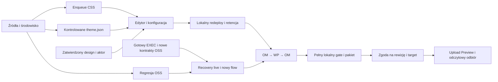

# QA + WordPress — ścieżka wdrożeń i równoległość

## Cel i stan wejściowy

Doprowadzić do lokalnie zbudowanej, przetestowanej, edytowalnej witryny WP,
przepuszczonej przez właściwy flow OM, a następnie wdrożyć zatwierdzoną gotową
rewizję do Studio Preview i odebrać ją odczytowo. Poniższy plan obejmuje całą
ścieżkę zależności. Użytkownik zniósł cap wdrożenia WP i polecił wykonać wszystkie
niezależne prace do bramki wymagającej kodu pozostałych członków zespołu.
Tam zatrzymujemy integrację i przygotowujemy wspólny merge; nie obniżamy kryteriów odbioru.

Stan zbadany 2026-09-19: lokalny HEAD `5d485ae5e713ba9c5c6f69809b4fba5b6b2f87c0`
plus niezacommitowane prace. SHA HEAD nie identyfikuje całej działającej rewizji:
każdy gate przypina także manifest źródeł/dependency/config i hashe artefaktów.

| Obszar | Już mamy | Czego to nie dowodzi |
|---|---|---|
| QA-02/03, OSS flow | 49/49 wykonań HTTP, 47 przypadków, cleanup; dowód historycznej rewizji | Regresji aktualnego main i nowych stage approvals |
| QA-04 | REC-01…10, 44 testy reguł unit/mock | Restartów procesu, realnego resume i dwóch runów |
| WP-M02 | 36 testów fixture mapowania OSS | Żywego OM→WP→OM |
| WP foundation | Live wtyczki, replay, noindex, native post/meta, cleanup, snapshot i HTTP | ACF/editor/SEO coverage, prawdziwego redeploy |
| Tailwind i tokeny | Realny lokalny compiler, fixture mapper, 93 testy pakietu/typecheck/build; CSS w snapshotcie | Enqueue frontend/editor, zastosowania theme.json, zatwierdzonego designu |
| EXEC | delivery-cezar adapter i delivery_agents skeleton | Execute API, trwałego bridge/worker/park/resume |
| Pełny gate | Zapisane polecenia i wcześniejsza awaria OOM | Pełnego lokalnego builda systemu; ignoreBuildErrors nie jest obejściem odbioru |

Źródła: [QA plan](../delivery-qa-readiness/plan.md), [main sync](../delivery-qa-readiness/main-sync-2026-09-19.md),
[WP F0](../wordpress-demo-foundation/evidence/README.md), [builder](../wordpress-local-theme-build/plan.md),
[mapper](../wordpress-design-token-mapping/plan.md), [handoff](../autonomous-software-delivery/flow-handoff/04-michal-wordpress-qa.md),
[produkt](../../../.ai/specs/2026-09-19-delivery-project-flow-addendum.md).

## Nienegocjowalne granice

- Instalacja, konfiguracja, kompilacja, testy i review odbywają się lokalnie.
  Preview otrzymuje gotową zatwierdzoną rewizję; żadnego zdalnego install/build/naprawiania.
- Polylang Free zostaje; tłumaczenia są deferred_by_user. Jednojęzyczne ACF/SEO,
  edytowalność i zachowanie treści pozostają wymagane.
- createSite v1, publiczne OSS DTO/API i dotychczasowe snapshot hash nie zmieniają
  znaczenia. Nowe operacje WP początkowo są wewnętrzne; publiczny host/deploy wymaga
  jawnej delty kontraktu uzgodnionej z właścicielem, zgodnie z BACKWARD_COMPATIBILITY.md.
- Nie przejmować runtime starego orchestratora ani prac właścicieli OSS/EXEC/Figma.
  Od nich wymagamy konkretnych artefaktów/kontraktów; nie wymyślamy API w testach.
- Przed DB odczytem liczników: jawne DATABASE_URL i rekord kontrolny utworzony przez
  testowane API. Żadnej domyślnej/zgadywanej bazy, cudzych danych lub migracji wspólnej DB.
- Historyczne dowody nie są nadpisywane. Każdy wynik ma provenance, rewizję, korelację,
  failed/not_run/missing, cleanup i jawne bramki ręczne; sam ToolCheck nie jest proof AC.

## Strumienie i odpowiedzialność

| Tor | Własność plików / wynik | Może działać równolegle z |
|---|---|---|
| Q — QA OSS i środowisko | delivery_os/__integration__, helpers/integration, prywatny descriptor i raport Q | Kodem W1/W2, dokumentacją/fixture D |
| W1 — CSS frontend/editor | Nowe theme-assets.ts + testy; zarządzane inc/assets.php i jawne podpięcie w motywie | W2 na osobnym fixture, Q i D |
| W2 — kontrolowane theme.json | Nowe theme-design-apply.ts + testy; design-tokens.ts tylko jeśli potrzeba konkretnej luki | W1 na osobnym fixture, Q i D |
| D — zależności i testy następnych etapów | Macierz ekran→blok/pole→aktor→test, readiness Preview, spec handoff EXEC/OSS | Q/W1/W2 bez uruchamiania dodatkowego runtime |
| Integrator/reviewer | Wspólny caller, plany, runbook/index, łączenie dowodów i kolejność bramek | Odczytowy review; jeden autor wspólnych plików |

Maksymalnie root + 3 subagentów. W pierwszym przyroście: Q, W1 i W2; root prowadzi
D oraz integrację. Nie ma czwartego równoczesnego podwykonawcy. Gdy W1 kończy,
może reviewować W2 i odwrotnie; osobny reviewer sprawdza spójność całej integracji.
Nie edytować współbieżnie scaffold.ts, istniejącego demo-probe.ts, kontraktów ani
wspólnego indeksu. Nowe nazwy plików są **proponowanymi plikami do utworzenia**.

### Równoległość kodu a zasoby runtime

| Operacje | Reguła |
|---|---|
| Q discovery/native + W1/W2 kod i unit + review | Równolegle, osobne pliki/fixture/raporty |
| Pełny build/typecheck OM + Studio/browser/live workers | Nie równolegle na tym hoście bez nowego pomiaru zasobów |
| Dwie WP operacje na tym samym siteId | Sekwencyjnie: jeden właściciel slotu i operation.lock |
| Browser edycja WP + snapshot tej witryny | Nie równolegle; snapshot może zatrzymać runtime |
| Build z odczytu źródeł + apply tych źródeł | Nie równolegle dla tego samego motywu |
| Zintegrowane OM + WP + worker | Jedno kontrolowane okno live po pomiarze headroom; jeśli nie mieści się, not_run/resource, bez cichego podnoszenia limitów |
| REC-08 dwa procesy wykonawcze | Właśnie równolegle, ale dopiero wewnątrz dedykowanego kontrolowanego testu, z osobnymi worktree i udowodnionym nakładaniem |

Poprzednie limity OM: app6GiB/2CPU, heap4096MiB, DB512MiB/1CPU; poprzedni app
osiągnął limit pamięci. Nie są gwarancją headroom hosta. Najpierw odczytać stan i
własność usług, wybrać runner wg .ai/docs/agent-instructions.md i zapisać wynik.
Przed ciężkim gate zatrzymać wyłącznie własne zbędne usługi. Nie usuwać zależności
ani cache innego toru; koordynować wspólne node_modules/generatory i build output.

## Bramki wejścia i krytyczna ścieżka

| Bramka | Konkretny warunek | Jeśli nie ma |
|---|---|---|
| G0 — aktualne źródła/środowisko | Zamrożony manifest z local diff, aktualny descriptor, własne DB/storage, sentinel API↔DB, budżet i slot runtime | Brak nowego PASS; odczyt/kod offline mogą trwać |
| G1 — rzeczywisty design | Eksport, rewizja DS/UI, pokrycie tokenów/font assets i rzeczywista zatwierdzona decyzja od strumienia designu | Fixture przygotowuje kod, nie zalicza WP-02/visual |
| G2 — aktor redakcyjny | Uzgodnione minimalne capabilities dla treści/menu/header/footer/Global Styles/ACF/SEO | Testy jako admin nie zaliczają redaktora; bez automatycznego nadawania administratora |
| G3 — EXEC/OSS | Implementacja execute/worker/bridge, trwały park/signal, probe procesu, cancel contract, kontrakty stage approvals | Live recovery/nowy flow zablokowany; istniejący OSS HTTP nadal wykonalny |
| G4 — lokalny release candidate | Lokalny WP-01…05 + wymagane FLOW/AC + pełny ordered gate systemu; kompletny manifest uploadu; brak niezakończonych mutacji | Żadnego uploadu ani zgody na inny hash |
| G5 — deployment | Zgoda człowieka/backendu na dokładny target+package revision i gotowy adapter | Przygotowanie/verify fixture możliwe, upload czeka |

Ścieżki zależności (fazy poniżej nie są globalnymi barierami dla niezależnych torów):

## Phase 1: Aktualna baza QA i rozdzielenie pracy

### Changes Required

Q czyta `.ai/qa/ephemeral-env.json` jeśli istnieje, nie przyjmuje starego URL jako
nowego środowiska. Zamraża aktualne źródła, konfigurację i zależności w izolowanym
runnerze bez utraty niezacommitowanych zmian. Sprawdza discovery istniejących
TC-DELIVERY-FIXTURE-001/001…008/010 oraz źródła EXEC. Odnotowuje stary OOM i
przygotowuje naprawę jego rzeczywistej przyczyny bez ignoreBuildErrors.
D weryfikuje wejścia G1/G2/G3 i kolejkę okien runtime. Nie startujemy wszystkich usług.

Pliki istniejące: `context/changes/delivery-qa-readiness/recovery-scenarios.md`,
`packages/core/src/helpers/integration/deliveryDbFixtures.ts`,
`packages/core/src/modules/delivery_os/__integration__/`, `.ai/agentic.config.json`.
Zaktualizować historyczne zdanie „delivery_agents nie istnieje”: obecnie jest skeleton,
ale nie ma działającego execute/workflow bridge. Nie zmieniać historycznych wyników.

### Success Criteria

#### Automated Verification:
- 1.1 Discovery oraz manifest aktualnej bazy i środowiska zapisane; sentinel i własność wymagane przed DB/readiness PASS.
- 1.2 Macierz G1/G2/G3 zawiera stan, właściciela, wymagany artefakt i warunek odblokowania; zasoby/budżet sprawdzone.

## Phase 2: Równoległa regresja OSS i domknięcie lokalnego motywu

### Changes Required

Q uruchamia istniejący fixture dwa razy (`--repeat-each=2 --retries=0 --workers=1`),
a następnie TC001…008/010 bez retry. Używa API fixtures A/A1/A2 i B/B1, checks ACL,
foreign scope, stale version, błędnych manifestów, duplikatów/concurrency oraz
reserve→result→review→verified/changes_requested. 49 to poprzedni mianownik,
nie sztywna liczba do uzyskania za wszelką cenę: nowe testy mają własne IDs.
Nowy dowód HTTP i pełny build mają osobne statusy.

W1 dodaje wewnętrzny `packages/delivery-wordpress/src/theme-assets.ts` i testy:
stały include do małego inc/assets.php, natywne frontend/editor enqueue skompilowanego
CSS, wersjonowanie URL po hash, bez CDN/Preflight. Zmiana tylko na owned site, pod lock,
po weryfikacji oczekiwanego hasha dotykanych plików. Istniejący createSite/scaffold v1
nie dostaje cichej zmiany; callsite wewnętrznego operatora przygotowania integruje root.
Nie nadpisywać dowolnego inc/setup.php ani funkcji użytkownika.

W2 dodaje wewnętrzny `theme-design-apply.ts` i testy: mapper fragment→kontrolowane
preset namespaces theme.json, expected-hash precondition, konflikt zamiast utraty zmian.
Zachować niepowiązane settings, całe styles i DB Global Styles. Nieznane formaty lub
kolizja istniejącego sluga bez potwierdzonej własności dają konflikt. Żadnego automatycznego
resetu DB. Fixture nie omija G1. Layout/radii/variants/font assets pozostają jawnymi
pozycjami mapowania do rzeczywistego eksportu; wspieramy tylko jawnie zweryfikowany zakres.

Root integruje realny wewnętrzny caller (proponowany `prepare-theme.ts`): kolejno
preflight→apply→enqueue→build→verify. Koordynator trzyma jeden operation.lock przez cały przebieg. Apply, enqueue i builder
udostępniają wewnętrzne walidujące prymitywy WithinLock bez przejmowania locka;
samodzielne wrappery zachowują własny withSiteLock. Prymitywy nie trafiają do index.ts.
Nie wywoływać wrapperów reentrant. Błąd lub crash zachowuje operation.lock, więc
istniejący captureSnapshot i przyszły upload odmawiają dostępu; test obejmuje crash
między krokami i odmowę snapshotu. Root odpowiada za refaktor buildera bez zmiany
jego samodzielnego zachowania. Po błędzie partial apply: journal/diff,
reconciliation i blokada snapshot/publikacji; odtworzenie tylko własnych zarządzanych
plików z prywatnej kopii przy zgodnych hashach, nigdy całej DB.

### Success Criteria

#### Automated Verification:
- 2.1 Aktualne HTTP przypadki i cleanup mają nowy manifest/provenance; każda odmowa bez niedozwolonego zapisu, błędy oddzielone od not_run.
- 2.2 W1/W2/caller przechodzą unit/negative/compiled-callsite checks oraz test konfliktu, replay i partial failure bez utraty plików/DB.
- 2.3 Po kolejnym buildzie CSS jest dostępny lokalnie i faktycznie zastosowany w frontendzie i edytorze; snapshot obejmuje jego aktualny hash.

## Phase 3: Natywny redaktor i rzeczywisty lokalny redeploy

### Changes Required

Po W1/W2 oraz G1/G2 przygotować własny zestaw stron, mediów, nawigacji, parts i
wersjonowanych definicji ACF bez danych/sekretów. Uzupełnić rzeczywistą konfigurację
Yoast/ACF/Polylang Free i testy wymaganych funkcji. Aktywacja licencji pozostaje
not_verified dopóki faktycznie jej nie sprawdzimy; blocker dotyczy konkretnej wymaganej
funkcji, nie domniemanego zakazu całego testu. Nie kupować licencji.

Proponowane wewnętrzne `editor-fixtures.ts` i `theme-update.ts` z unit tests przy pakiecie;
nowy browser spec umieścić przy rzeczywistym właścicielskim module/callsite zgodnie z
`.ai/qa/AGENTS.md`. Dokładne selectors wynikają z lokalnego browser probe, nie z założeń.
Fixture/browser scaffolding można przygotować już w fazie2; mutacje site dopiero w jego slocie.

Browser actor zapisuje i ponownie odczytuje tekst, media, CTA, kolejność/dodanie sekcji,
menu/header/footer, ACF i SEO bez kodu/builda. Następnie zmieniamy rzeczywiste pliki
zarządzanej wersji motywu, lokalnie budujemy i ponownie odczytujemy treści/ACF/SEO/
Global Styles. Nie przywracamy starej DB. Replay instalacji wtyczek nie jest redeploy.
Cleanup ograniczony do obiektów fixture; zachować wybraną witrynę demo zatrzymaną.

### Success Criteria

#### Automated Verification:
- 3.1 WP-03/04 mają zapisane wyniki browser actor + readback dla pełnej macierzy jednojęzycznej, z prawdziwymi ACF/SEO.
- 3.2 WP-05 zachowuje edycje po zmianie plików i nowym buildzie, wykrywa konflikt designu i potwierdza cleanup fixture.
#### Manual Verification:
- 3.3 Odbiór zgodności zaakceptowanego designu na desktop/mobile oraz uprawnień redaktora przez człowieka.

## Phase 4: QA-04 live, nowy flow i OM→WP→OM

### Changes Required

Warunek G3 dostarcza właściciel EXEC/OSS; sam adapter delivery-cezar nie wystarcza.
Testy API/UI nowych FLOW shipping razem z funkcją w module właściciela. Przygotowanie
macierzy może trwać równolegle z fazą2/3, wykonanie live dopiero po dostępnych seamach.

Rozstrzygnąć przed testem mid-run cancel: EXEC-04 proponuje przy cancel import
`outcome: cancelled`, natomiast bieżący TC-DELIVERY-007 odrzuca late result przez
`attempt_cancelled`. Właściciele muszą określić dozwoloną wewnętrzną ścieżkę i kontrakt;
nie zmieniać testu v1 tylko po to, żeby nowy executor przeszedł.

Wykonać REC-01…10 z realnym workerem/Redis/park/signal, punktami awarii i probe procesu.
Osobne worktree dla REC08; logi dowodzą przecięcia czasów. Liczniki spawn/evidence/
effective-resume oddzielają delivery retry od ponownego wykonania. Nie emulować crash
edycją DB. Wymagana kontrola stale approvals, wznowienia oczekiwania na zgodę oraz
unieważniania downstream w nowym flow; stary design v1 nie zastępuje Scope/UX/KV/UI.

WP-M02 live wiąże autorytatywny scope, project/task/attempt/baseline, wersję package,
bazowy i wynikowy workspace, checks i źródłowe artefakty. Mapper odrzuca obcy wynikowy
workspace; znany brak tej ochrony w istniejącym OSS pozostaje osobnym handoffem do
właściciela, bez cichej zmiany API. Review/poprawka wymagają nowego kompletu AC dla
finalnej rewizji, nie przenoszenia starego PASS. UI→Figma→staff/Workflows wymaga G1/G3.

### Success Criteria

#### Automated Verification:
- 4.1 REC01…10 i nowe FLOW mają rzeczywiste checkpointy, liczniki, korelację, testy negatywne i bezpieczny cleanup; not_run pozostawia kryterium niezaliczone.
- 4.2 OM→WP→OM przechodzi result/review/correction/verified na finalnej rewizji, bez fałszywej akceptacji obcego workspace lub starej zgody.

## Phase 5: Kompletny lokalny kandydat i pełny gate

### Changes Required

Read-only readiness Studio i projekt manifestu pakietu można prowadzić w torze D od
fazy1; nie uruchamiają uploadu. Ustalić co Studio faktycznie eksportuje/przepisuje i jak
wiązać zatwierdzony manifest z wysłanymi bajtami. Wersjonowany manifest obejmuje motyw,
wtyczki, media, spójny DB snapshot, identity runtime i potrzebną konfigurację, wykluczając
sekrety, backupy, lokalne logi i ZIP źródłowe. Płatny kod/bazy pozostają prywatne, do repo
trafiają wyłącznie bezpieczne metadane/hash. Nie wykluczać aktywnej DB/WAL bez zapewnienia
spójnej kopii. Stare snapshot.ts theme+DB nie staje się „pełnym pakietem” przez zmianę etykiety.

Proponowane `deployment-manifest.ts`/`preview.ts` i testy dopiero po read-only probe oraz
przeglądzie delty; publiczny contract jeśli potrzebny uzgadnia właściciel. Adapter musi
zachować korelację/reconcile/verify-only i nie tworzyć drugiego site/uploadu po timeout.
Przy braku atomowego rollback Studio nie obiecywać przywrócenia; uzgodniona ścieżka to
reconcile i ewentualny re-upload uprzednio zatwierdzonej zachowanej paczki.

Wykonać pełny ordered gate z `.ai/agentic.config.json` na zamrożonej finalnej bazie
(polecenia poniżej). Ciężką awarię OOM diagnozować już w torze Q; nie odkładać wykrycia
na moment zgody publikacji. Zmiana źródeł/konfiguracji po gate unieważnia odpowiednie
raporty i kandydata; uruchomić dotknięte kontrole, pełny final gate wymagany przed release.

### Success Criteria

#### Automated Verification:
- 5.1 Pełny ordered gate lokalny przechodzi bez ignoreBuildErrors i bez uznania narrow TS za pełny build; zasoby i source manifest zapisane.
- 5.2 Manifest kompletnej przygotowanej witryny wiąże checks i candidate revision z rzeczywistą zawartością deploymentu, bez sekretów; timeout/reconcile adaptera przetestowane.

## Phase 6: Deployment Preview i końcowy odbiór

### Changes Required

G4/G5: przedstawić gotowy lokalny kandydat, testy, hash i docelowy Preview do wymaganej
zgody. Dopiero potem upload gotowej witryny przez ograniczony adapter. Po stronie Preview
wyłącznie odczytowo sprawdzić dokładny revision marker, HTTP, media, desktop/mobile,
noindex i wymaganą bramkę dostępu. Nie zakładać, że sam PHP gate chroni statyczne media.
Nie instalować wtyczek/zależności i nie budować/naprawiać zdalnie. Jeśli Studio przepisuje
URL/DB w transferze, jawnie rozróżnić lokalny manifest i dowód marker/mapping po transferze;
nie deklarować identyczności hashy bez podstawy.

URL po niepewnym uploadzie pozostaje unverified do reconcile/verify-only. Błąd oznacza
lokalną poprawkę, nowy build/checks i właściwą zgodę na nową rewizję. Operator zachowuje
niezmienione historyczne raporty; indeks mapuje wszystkie FLOW/WP/REC i manualne odbiory.

### Success Criteria

#### Automated Verification:
- 6.1 Zatwierdzony target+revision odpowiadają opublikowanej wersji i odczytowym dowodom; retry nie duplikuje publikacji.
#### Manual Verification:
- 6.2 Człowiek odbiera konkretny URL/revision, zakres braków oraz cleanup; domknięte QA1.3/7.3 mają własne potwierdzenie, nie automatyczny checkmark.

## Walidacja i review loop każdej porcji

1. Jedna mała porcja na ustalonej własności plików; unit/negative tests wraz z kodem.
2. Weryfikacja adekwatna do zmiany i niezależny review plan adherence + safety/patterns.
3. Poprawki → testy dotkniętych ścieżek → re-review. Bez otwartych blockerów porcji.
4. Integrator przypina source/build/fixture/live hashes, aktualizuje macierz i budżet.
5. Pełny final ordered gate i ręczne zgody nie są zastępowane review lub unit PASS.

Polecenia WP (z prywatnym zgodnym toolchain 4.3.3, bez hardcoded local path):
`WP_TAILWIND_TOOLCHAIN_ROOT=<private-toolchain> npm test --prefix packages/delivery-wordpress`,
`npm run typecheck --prefix packages/delivery-wordpress`, `npm run build --prefix packages/delivery-wordpress`.

Discovery QA: `npx playwright test --config .ai/qa/tests/playwright.config.ts --list`.
HTTP: `yarn test:integration --grep 'TC-DELIVERY-FIXTURE-001' --workers=1 --retries=0 --repeat-each=2`,
następnie `yarn test:integration --grep 'TC-DELIVERY-00[1-8]|TC-DELIVERY-010' --workers=1 --retries=0`.
Po wybraniu Docker runner wszystkie odpowiedniki przez `node scripts/docker-exec.mjs`;
nie mieszać runnerów w jednym gate. Descriptor i auth poza repo.

Ordered gate: `yarn build:packages` → `yarn generate` → `yarn build:packages` →
`yarn i18n:check-sync` → `yarn i18n:check-usage` → `yarn typecheck` → `yarn test` →
`yarn build:app`. Przed uruchomieniem potwierdzić aktualną listę w configu.

## Estymaty, zniesienie cap i zakres wykonania

Użytkownik 2026-09-19 zniósł cap wdrożenia WP oraz polecił wdrożyć wszystko w tej
kolejności do momentu, w którym potrzebny jest kod pozostałych członków zespołu.
Wcześniejsze 6h/pozostałe204min i proponowany timebox150min **nie ograniczają wykonania**.
[Ledger](../delivery-qa-readiness/wp-budget.md) zachowuje historyczne pomiary, bez
udawania, że wcześniejszy limit nadal obowiązuje. Zasady bezpieczeństwa zasobów,
kontraktów i akceptacji publikacji pozostają w mocy. Nie robimy teraz wspólnego merge.

| Porcja | Wstępny szacunek z testami/review | Kolejność / zależność |
|---|---:|---|
| QA discovery/native | 30–60min QA | Od razu równolegle z W1/W2 |
| QA HTTP | 60–120min QA po środowisku | Osobny slot OM; naprawy OOM osobno |
| QA recovery przygotowanie | 30–45min QA | Bez czekania na executor |
| QA recovery live | 2–4h QA | Dopiero działający kod G3, nie skeleton |
| W1 enqueue | 45–90min WP | Pierwszy przyrost |
| W2 theme.json apply | 60–120min WP | Kod równolegle, mutacje site sekwencyjnie |
| WP redaktor/konfiguracja | 2–4h WP | W1/W2; fixture techniczne wcześniej, odbiór designu wymaga G1/G2 |
| WP redeploy/retencja | 1.5–3h WP | Rzeczywiste lokalne edycje i operacja aktualizacji |
| Preview readiness / kompletny pakiet | 45–90min +90–180min WP | Readiness od fazy1; niezależny pakiet/adapter nie czeka na kod hosta |
| Preview adapter | 2–4h WP | Implementacja wewnętrzna po probe, integracja publiczna po kontrakcie |
| OM→WP→OM | 2–4h pracy WP plus QA | Bramka kodu EXEC/OSS, gotowe lokalne WP |

Szacunki są orientacyjne, bez terminu ukończenia ani implementacji innych właścicieli.
Root działa jako integrator, subagenci mają ograniczone plikowo zadania i przekazują
zmiany do review loop. Brak G1 blokuje rzeczywisty odbiór designu, ale nie implementację
bezpiecznego local apply na fixture. Brak G3 blokuje live recovery/OM roundtrip, ale nie
niezależny pakiet i adapter Preview z testami. Wykonujemy te niezależne gałęzie przed
końcowym handoffem, zamiast kończyć przy pierwszej napotkanej zależności.

**Warunek zatrzymania przed wspólnym merge:** wszystkie wykonalne lokalne zakresy
własnego toru mają kod, adekwatne testy i zamknięty review; pozostałe kontrole mają
konkretną zależność od wskazanej implementacji/kontraktu zespołu lub rzeczywistego
artefaktu/akceptacji. Handoff wskazuje właściciela, pliki/wersję potrzebnego kontraktu,
przypadki do odpalenia po merge i zachowane dowody. Nie implementujemy zastępczego
executora, etapów/zgód OSS czy fikcyjnej Figmy. Upload Preview pozostaje osobną bramką
G4/G5, nawet gdy kod adaptera i wszystkie jego fixture są gotowe.

## Progress

Aktualne polecenie użytkownika: pełny build i ciężkie kontrole live przenosimy na
drugi komputer. Tutaj kończymy kod, offline tests i review. Baza integracji
`67aa2d1f8` + overlay; [aktualny handoff](offline-handoff.md). Kryteria pozostają bez zmian.

Checkpoint 2026-09-19: aktualny main `68361d163` połączony z pracami lokalnymi.
Run8 jest pełnym browser/native PASS na własnej witrynie i fixture designu;
`evidence/browser-editor-run-8.json` oraz snapshot/paczka przypięta do CSS w
`evidence/post-browser-local-package.json` zamykają techniczne 2.3/3.1/3.2.
Nie zaliczają G1 ani ręcznego 3.3, pełnego OM→WP→OM, release czy Preview.

### Phase 1: Aktualna baza QA i rozdzielenie pracy
- [x] 1.1 Discovery oraz manifest aktualnej bazy i środowiska zapisane; sentinel i własność wymagane przed DB/readiness PASS.
- [x] 1.2 Macierz G1/G2/G3 zawiera stan, właściciela, wymagany artefakt i warunek odblokowania; zasoby/budżet sprawdzone.

### Phase 2: Równoległa regresja OSS i domknięcie lokalnego motywu
- [ ] 2.1 Aktualne HTTP przypadki i cleanup mają nowy manifest/provenance; każda odmowa bez niedozwolonego zapisu, błędy oddzielone od not_run.
- [x] 2.2 W1/W2/caller przechodzą unit/negative/compiled-callsite checks oraz test konfliktu, replay i partial failure bez utraty plików/DB.
- [x] 2.3 Po kolejnym buildzie CSS jest dostępny lokalnie i faktycznie zastosowany w frontendzie i edytorze; snapshot obejmuje jego aktualny hash.

### Phase 3: Natywny redaktor i rzeczywisty lokalny redeploy
- [x] 3.1 WP-03/04 mają zapisane wyniki browser actor + readback dla pełnej macierzy jednojęzycznej, z prawdziwymi ACF/SEO.
- [x] 3.2 WP-05 zachowuje edycje po zmianie plików i nowym buildzie, wykrywa konflikt designu i potwierdza cleanup fixture.
- [ ] 3.3 Odbiór zgodności zaakceptowanego designu na desktop/mobile oraz uprawnień redaktora przez człowieka.

### Phase 4: QA-04 live, nowy flow i OM→WP→OM
- [ ] 4.1 REC01…10 i nowe FLOW mają rzeczywiste checkpointy, liczniki, korelację, testy negatywne i bezpieczny cleanup; not_run pozostawia kryterium niezaliczone.
- [ ] 4.2 OM→WP→OM przechodzi result/review/correction/verified na finalnej rewizji, bez fałszywej akceptacji obcego workspace lub starej zgody.

### Phase 5: Kompletny lokalny kandydat i pełny gate
- [ ] 5.1 Pełny ordered gate lokalny przechodzi bez ignoreBuildErrors i bez uznania narrow TS za pełny build; zasoby i source manifest zapisane.
- [ ] 5.2 Manifest kompletnej przygotowanej witryny wiąże checks i candidate revision z rzeczywistą zawartością deploymentu, bez sekretów; timeout/reconcile adaptera przetestowane.

### Phase 6: Deployment Preview i końcowy odbiór
- [ ] 6.1 Zatwierdzony target+revision odpowiadają opublikowanej wersji i odczytowym dowodom; retry nie duplikuje publikacji.
- [ ] 6.2 Człowiek odbiera konkretny URL/revision, zakres braków oraz cleanup; domknięte QA1.3/7.3 mają własne potwierdzenie, nie automatyczny checkmark.
